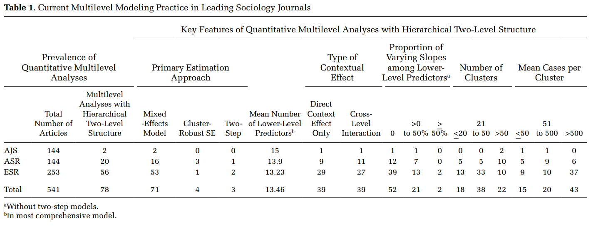
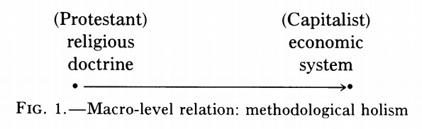
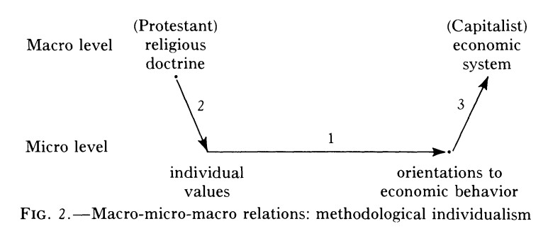
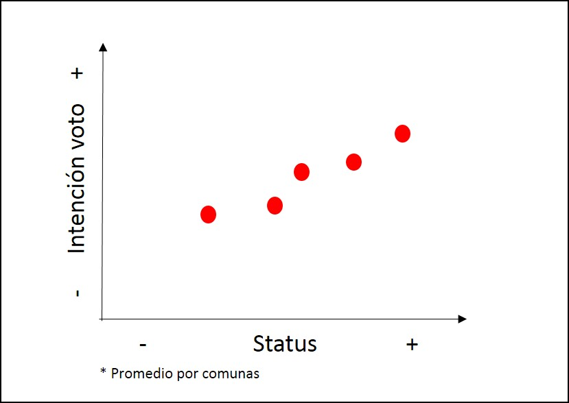
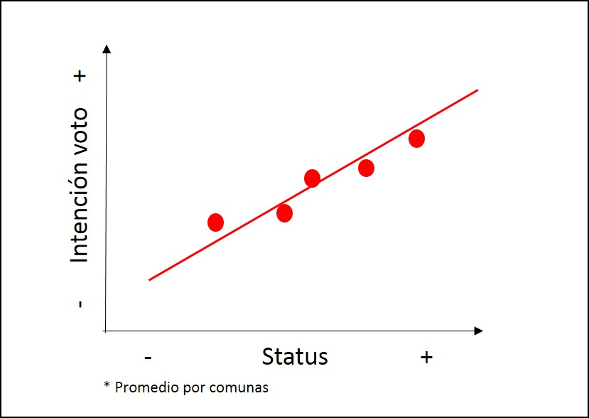
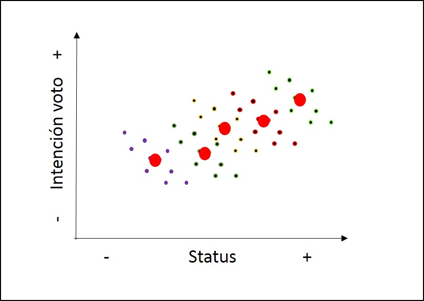
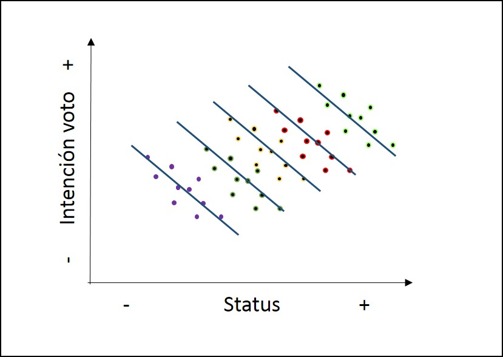

class: front


```{r setup, include=FALSE, cache = FALSE}
require("knitr")
options(htmltools.dir.version = FALSE)
pacman::p_load(RefManageR)
bib <- ReadBib("../files/bib/electivomultinivel.bib", check = FALSE)
opts_chunk$set(warning=FALSE,
             message=FALSE,
             echo=FALSE,
             cache = FALSE, fig.width=7, fig.height=5.2)
pacman::p_load(flipbookr, tidyverse)
```


```{r xaringanExtra, include=FALSE}
xaringanExtra::use_xaringan_extra(c("tile_view", "animate_css"))
xaringanExtra::use_scribble()
```

.pull-left-wide[
# Modelos multinivel]

.pull-right-narrow[]

## Unidades en contexto

----
.pull-left[

## Juan Carlos Castillo
## Sociología FACSO - UChile
## 2do Sem 2023 
## [.yellow[multinivel.netlify.com]](https://encuestas-sociales.netlify.com)
]
    

.pull-right-narrow[
.center[
.content-block-gray[
## Sesión 1: 
# **.white[Presentación]**]
]
]
---

layout: true
class: animated, fadeIn

---
class: inverse right


### ¿Qué es un problema de investigación multinivel?

--

### ¿Cuál es la relación entre problemas multinivel y sociología?

--

### ¿Cómo modelar un problema de investigación multinivel?

---
class: middle, center, roja

# Marco general

---
# Concepto del curso/taller

.pull-left[
-   Investigación social aplicada

-   Ciencia abierta: Reproducibilidad, colaboración, comunicación

-   Orientación práctica

-   Carácter introductorio]

--

.pull-right[

-   Basado en conocimientos previos (extensión de modelo de regresión   simple)

-   Relativa flexibilidad a ritmos, capacidades, intereses de alumnos

-   Mayor desafío: cognitivo (acomodación de esquemas)]

---
# Unidades del programa:

## 1.  Introducción

## 2.  Profundización

## 3.  Aplicación


Detalles en [https://multinivel.netlify.com/](https://multinivel.netlify.com)


---
# Software

1.  Análisis de datos: R

2.  Reporte: Knitr / Markdown / Rmarkdown (RStudio)

3.  Administración referencias: Zotero / Bibtex

4.  (Git / GitHub)

5.  (LaTeX)

---
class: middle, center, roja

# Investigacion sociológica, contexto y multinivel

---
# Investigación multinivel



`r Cite (bib, "heisig_Costs_2017")`

---
class:inverse, right, middle

#### Multilevel models are used in sociology to specify the effect of social context on individual-level outcomes. The idea that individuals respond to their social context is a defining claim of the sociological discipline, which is found in Marx’s work on political  economy (1846), in Durkheim’s studies of the impact of community on anomia and suicide (1897), in Weber’s research on how religious communities shape economic behavior (1905), in Merton’s work on communities, relative deprivation, and social comparison theory (1968), and in Berelson et aI’s (1954) research into the effect of social context on voting.

(Diprete, 1994)

`r Cite(bib, "diprete_Multilevel_1994")`

---
# Investigación sociológica y contexto


.right[
(adaptado de Coleman, 1986)]
`r Cite (bib, "Coleman1986SocialTheorySocial")`

---
# Investigación sociológica y contexto

<br>

.center[

]


---
# Investigación sociológica y contexto




---
# Versiones del contexto

-   Variables macro / nivel 2
  -   Ejemplos: Países, comunas, escuelas, organizaciones

-   Tiempo

---
# Datos anidados / con estructura jerárquica
<br>

| IDi | IDg | var_i1 | var_i2 | var_g1 | var_g2 |
|-----|-----|--------|--------|--------|--------|
| 1   | 1   | 8      | 7      | 4      | 1      |
| 2   | 1   | 5      | 5      | 4      | 1      |
| 3   | 1   | 3      | 1      | 4      | 1      |
| 4   | 2   | 3      | 2      | 6      | 8      |
| 5   | 2   | 1      | 4      | 6      | 8      |
| 6   | 2   | 7      | 5      | 6      | 8      |

---
# Tipos de datos macro

.pull-left[
- idiosincráticos o propiamente macro, ej:

  - desigualdad
  - tamaño de una escuela
  - nivel de contaminación del aire de una comuna
]

--

.pull-right[
- agregados desde información individual, ej:

  - promedio de notas de un curso
  - número de habitantes de una comuna
]
---
class: roja, middle, center

# Posibles problemas de inferencia con datos jerarquicos

---
# Problemas asociados a la inferencia y el contexto

--

## Falacia ecológica:

- Conclusiones erradas acerca de individuos basados en datos de contexto

--

## Falacia individualista:

-   Conclusiones erradas acerca de contextos basados en datos de individuos


---
# Ejemplo falacia ecológica

Relación entre estatus socioeconómico e intención de voto




---
# Falacia ecológica



---
# Falacia ecológica



---
# Falacia ecológica



---
# Falacia ecológica


---
# Implicancias falacia ecológica

-   Relaciones individuales y contextuales no necesariamente van en la misma dirección (lineal)

-   Falacias también pueden ocurrir en la otra dirección (falacia individualista)

-   Por lo tanto la inferencia ecológica (contextual) no se corresponde necesariamente con la inferencia individual

-   Distinguir ambos niveles es clave para estimación multinivel

---
# Falacia Ecológica


-   Blakely, T. A., & Woodward, A. J. (2000). Ecological effects in multi-level studies. Journal of Epidemiology and Community Health, 54(5), 367–374.

-   Robinson W S 1950. Ecological correlations and the behavior of individuals. American Sociological Review 15: 351–57

---
# Contexto e implicancias teóricas

En el planteamiento de una investigación con hipótesis multinivel, es
relevante definir:

-   Qué es el contexto

-   Cuáles son los elementos principales del contexto a considerar en las hipótesis

-   Cómo se relacionan variables del contexto con variables individuales (hipótesis)

---
## Ejemplos

-   Educación

-   Opinión pública

-   Participación política

---
# Contexto e implicancias estadísticas

-   Estructuras de datos jerárquicos: variables nivel 1 (micro) y nivel 2 (macro)

-   Implicancias estadísticas asociadas a incorporación de variables contextuales a modelos de regresión con datos individuales (dependencia contextual)
.medium[

  1. viola los supuestos de independencia de los residuos del modelo de regresión OLS (dependencia como “ruido”)

2. pero ... permite estudiar fenómenos que van más allá de hipótesis individuales (dependencia como fenómeno interesante)]

---
# Contexto e implicancias estadísticas

-   Por lo tanto, los modelos multinivel tienen dos sentidos principales a nivel estadístico:

  - .red[Corregir estimaciones] con variables individuales cuando existe dependencia contextual (disminuye el error)

  - Hacen posible .red[contrastar hipótesis que abarcan relaciones entre niveles], e incluir el contexto en el modelamiento estadístico

---
class:roja, center, middle

# Modelos multinivel

---
## Modelos multinivel

-   **Definición minimalista**: modelos de regresión que incluyen variables individuales y contextuales

-   Otras versiones: modelos jerárquicos, modelos mixtos, modelos contextuales, modelos con efectos aleatorios

---
## Tipos generales de problemas multinivel

Tres tipos de preguntas básicas, ejemplo educación:

1.  ¿Existen diferencias de rendimiento académico de los alumnos entre escuelas?

2.  ¿Tienen estas diferencias relación con variables de la escuela?

3.  Las características de los estudiantes, ¿poseen un efecto distinto en rendimiento de acuerdo a características de las escuelas?

---
# Formas de estimación multinivel

Base: modelo de regresión simple (no multinivel)


---
# Formas de estimación multinivel

Modelo multinivel con predictores individuales


---
# Formas de estimación multinivel

Modelo multinivel con predictores contextuales


---
# Formas de estimación multinivel

Modelo multinivel con predictores individuales y contextuales


---
# Formas de estimación multinivel

Modelo multinivel con interacción entre niveles


---
class: inverse

## Resumen

.pull-left[
-   Contexto en sociología

-   Extensión del modelo de regresión simple

-   Distintos problemas de investigación multinivel]

.pull-right[

-   Aplicaciones en distintos ámbitos y disciplinas

-   Diferencia entre nivel individual y contextual (witihin/between)

-   Permite contrastar hipótesis más complejas de relaciones micro/macro
]

---
class: front
.pull-left-wide[
# Modelos multinivel]

.pull-right-narrow[]

## Unidades en contexto

----
.pull-left[

## Juan Carlos Castillo
## Sociología FACSO - UChile
## 2do Sem 2023 
## [.yellow[multinivel.netlify.com]](https://encuestas-sociales.netlify.com)
]
    

.pull-right-narrow[
.center[
.content-block-gray[
## Sesión 1: 
# **.white[Presentación]**]
]
]
