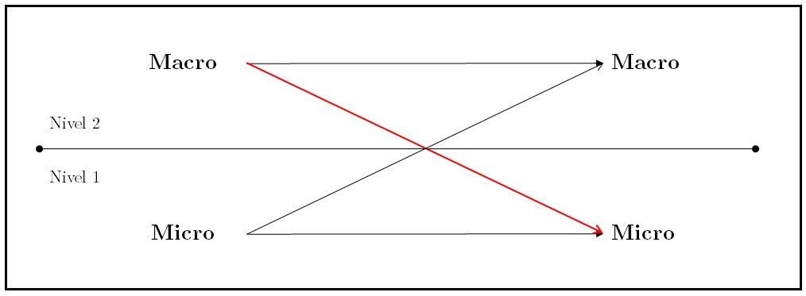
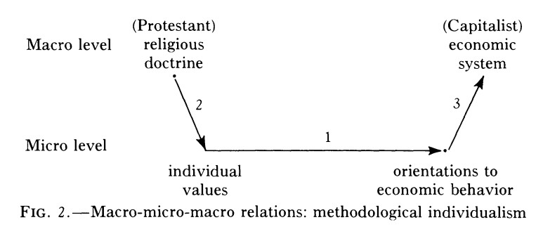

class: front


```{r setup, include=FALSE, cache = FALSE}
require("knitr")
pacman::p_load(RefManageR)
bib <- ReadBib("../files/bib/electivomultinivel.bib", check = FALSE)
opts_chunk$set(warning=FALSE,
             message=FALSE,
             echo=FALSE,
             cache = FALSE, fig.width=7, fig.height=5.2)
pacman::p_load(flipbookr, tidyverse)
```


```{r xaringanExtra, include=FALSE}
xaringanExtra::use_xaringan_extra(c("tile_view", "animate_css"))
xaringanExtra::use_scribble()
```

.pull-left-wide[
# Modelos multinivel]

.pull-right-narrow[]

## Unidades en contexto

----
.pull-left[

## Juan Carlos Castillo
## Sociología FACSO - UChile
## 1er Sem 2025
## [.yellow[multinivel-facso.netlify.app]](multinivel-facso.netlify.app)
]
    

.pull-right-narrow[
.center[
.content-block-gray[
## Sesión 1: 
# **.white[Introducción y bases]**]
]
]
---

layout: true
class: animated, fadeIn

---
class: roja middle

# ¿Cómo se relaciona el nivel socioeconómico con la tendencia de voto (sentido izq-der)?


---


```{r echo=FALSE, fig.width=5, fig.height=2.4, dpi=200}
# Fijar semilla para reproducibilidad
set.seed(123)

# Generar variable status (entre 0 y 100)
status <- runif(50, min = 0, max = 100)

# Generar izq_der como función de status con ruido, acotada entre 0 y 10
izq_der_raw <- status * 0.08 + rnorm(50, mean = 0, sd = 3)  # Relación positiva + ruido
izq_der <- pmin(pmax(izq_der_raw, 0), 10)  # Limitar entre 0 y 10

# Crear data frame
data <- data.frame(status, izq_der)

# Cargar ggplot2
library(ggplot2)

# Graficar
ggplot(data, aes(x = status, y = izq_der)) +
  geom_point(size = 3, color = "steelblue") +  # Puntos
  geom_smooth(method = "lm", se = FALSE, color = "darkred", linetype = "dashed") +  # Línea de tendencia
  labs(
    x = "Status",
    y = "Izquierda - Derecha",
    title = "Estatus y Escala Izquierda-Derecha"
  ) +
  scale_y_continuous(limits = c(0, 10)) +  # Limitar eje Y entre 0 y 10
  theme_minimal(base_size = 14)


```

---

```{r echo=FALSE, fig.width=5, fig.height=3, dpi=200}
# Fijar semilla para reproducibilidad
set.seed(123)

# Generar variable status (entre 0 y 100)
status <- runif(50, min = 0, max = 100)

# Generar izq_der como función de status con más ruido, acotada entre 0 y 10
izq_der_raw <- status * 0.08 + rnorm(50, mean = 0, sd = 3)  # Más dispersión con sd = 3
izq_der <- pmin(pmax(izq_der_raw, 0), 10)  # Limitar entre 0 y 10

# Crear data frame base
data <- data.frame(status, izq_der)

# Asignar grupos estratégicos (como definimos antes)
grupo <- rep(NA, 50)  # Inicializar vector vacío

# Grupo 1: status altos + izq_der bajos
grupo[head(order(data$status, decreasing = TRUE), 10)] <- 1

# Grupo 2: status bajos + izq_der altos
grupo[head(order(data$status, decreasing = FALSE), 10)] <- 2

# Grupo 3: status bajos + izq_der bajos
grupo[intersect(head(order(data$status), 20), head(order(data$izq_der), 20))][1:10] <- 3

# Grupo 4: status altos + izq_der altos
grupo[intersect(head(order(data$status, decreasing = TRUE), 20), head(order(data$izq_der, decreasing = TRUE), 20))][1:10] <- 4

# Grupo 5: intermedios (los que no caen en otros grupos)
grupo[which(is.na(grupo))] <- 5

# Añadir grupos al data frame
data$grupo <- factor(grupo)

# Cargar ggplot2
library(ggplot2)

# Gráfico solo con los puntos coloreados por grupo (sin rectas ni promedios)
ggplot(data, aes(x = status, y = izq_der, color = grupo)) +
  geom_point(size = 3) +  # Puntos coloreados por grupo
  labs(
    x = "Status",
    y = "Izquierda - Derecha",
    title = "Estatus y Escala Izquierda-Derecha"
  ) +
  scale_y_continuous(limits = c(0, 10)) +  # Limitar eje Y
  theme_minimal(base_size = 14) +
  theme(legend.position = "bottom")  # Leyenda abajo

```

---
```{r echo=FALSE, fig.width=5, fig.height=3, dpi=200}

# Fijar semilla para reproducibilidad
set.seed(123)

# Generar variable status (entre 0 y 100)
status <- runif(50, min = 0, max = 100)

# Generar izq_der como función de status con más ruido, acotada entre 0 y 10
izq_der_raw <- status * 0.08 + rnorm(50, mean = 0, sd = 3)  # Más dispersión con sd = 3
izq_der <- pmin(pmax(izq_der_raw, 0), 10)  # Limitar entre 0 y 10

# Crear data frame base
data <- data.frame(status, izq_der)

# Asignar grupos estratégicos (como definimos antes)
grupo <- rep(NA, 50)  # Inicializar vector vacío

# Grupo 1: status altos + izq_der bajos
grupo[head(order(data$status, decreasing = TRUE), 10)] <- 1

# Grupo 2: status bajos + izq_der altos
grupo[head(order(data$status, decreasing = FALSE), 10)] <- 2

# Grupo 3: status bajos + izq_der bajos
grupo[intersect(head(order(data$status), 20), head(order(data$izq_der), 20))][1:10] <- 3

# Grupo 4: status altos + izq_der altos
grupo[intersect(head(order(data$status, decreasing = TRUE), 20), head(order(data$izq_der, decreasing = TRUE), 20))][1:10] <- 4

# Grupo 5: intermedios (los que no caen en otros grupos)
grupo[which(is.na(grupo))] <- 5

# Añadir grupos al data frame
data$grupo <- factor(grupo)

# Cargar ggplot2
library(ggplot2)

# Gráfico de puntos coloreados por grupo + líneas de regresión por grupo
ggplot(data, aes(x = status, y = izq_der, color = grupo)) +
  geom_point(size = 3) +  # Puntos coloreados por grupo
  geom_smooth(method = "lm", se = FALSE, linetype = "dashed") +  # Línea de regresión por grupo
  labs(
    x = "Status",
    y = "Izquierda - Derecha",
    title = "Estatus y Escala Izquierda-Derecha"
  ) +
  scale_y_continuous(limits = c(0, 10)) +  # Limitar eje Y
  theme_minimal(base_size = 14) +
  theme(legend.position = "bottom")  # Leyenda abajo


```
---

```{r echo=FALSE, fig.width=5, fig.height=3, dpi=200}
# Fijar semilla para reproducibilidad
set.seed(123)

# Generar variable status (entre 0 y 100)
status <- runif(50, min = 0, max = 100)

# Generar izq_der como función de status con más ruido, acotada entre 0 y 10
izq_der_raw <- status * 0.08 + rnorm(50, mean = 0, sd = 3)  # Más dispersión con sd = 3
izq_der <- pmin(pmax(izq_der_raw, 0), 10)  # Limitar entre 0 y 10

# Crear data frame base
data <- data.frame(status, izq_der)

# Asignar grupos estratégicos (como definimos antes)
grupo <- rep(NA, 50)  # Inicializar vector vacío

# Grupo 1: status altos + izq_der bajos
grupo[head(order(data$status, decreasing = TRUE), 10)] <- 1

# Grupo 2: status bajos + izq_der altos
grupo[head(order(data$status, decreasing = FALSE), 10)] <- 2

# Grupo 3: status bajos + izq_der bajos
grupo[intersect(head(order(data$status), 20), head(order(data$izq_der), 20))][1:10] <- 3

# Grupo 4: status altos + izq_der altos
grupo[intersect(head(order(data$status, decreasing = TRUE), 20), head(order(data$izq_der, decreasing = TRUE), 20))][1:10] <- 4

# Grupo 5: intermedios (los que no caen en otros grupos)
grupo[which(is.na(grupo))] <- 5

# Añadir grupos al data frame
data$grupo <- factor(grupo)

# Cargar dplyr para calcular promedios
library(dplyr)

# Calcular promedios por grupo
data_promedios <- data %>%
  group_by(grupo) %>%
  summarise(
    status = mean(status),
    izq_der = mean(izq_der)
  )

# Cargar ggplot2
library(ggplot2)

# Gráfico completo
ggplot() +
  # Nube de puntos original, coloreada por grupo
  geom_point(data = data, aes(x = status, y = izq_der, color = grupo), size = 3) +
  # Línea de regresión por grupo (con mismo color)
  geom_smooth(data = data, aes(x = status, y = izq_der, color = grupo), method = "lm", se = FALSE, linetype = "dashed") +
  # Puntos grandes para promedios de grupo
  geom_point(data = data_promedios, aes(x = status, y = izq_der, color = grupo), size = 6, shape = 21, fill = "white", stroke = 2) +
  # Recta de regresión basada solo en los promedios (en rojo punteada)
  geom_smooth(data = data_promedios, aes(x = status, y = izq_der), method = "lm", se = FALSE, color = "red", linetype = "dotted", size = 1.3) +
  # Etiquetas y formato
  labs(
    x = "Status",
    y = "Izquierda - Derecha",
    title = "Estatus y Escala Izquierda-Derecha",
    color = "Grupo"
  ) +
  scale_y_continuous(limits = c(0, 10)) +  # Limitar eje Y
  theme_minimal(base_size = 14) +
  theme(legend.position = "bottom")  # Leyenda abajo

```

---
# ¿Cómo incorporar el .blue[contexto] al análisis de datos?

1. ¿en qué medida una medición se ve afectada por elementos contextuales?

2. ¿existen diferencias entre asociaciones a nivel individual y contextual?

3. si estas diferencias existen, ¿qué elementos del contexto podrían dar cuenta de estas diferencias?


---
# Ejemplo educación:

1.  ¿Existen diferencias de rendimiento académico de los alumnos entre escuelas?

2.  ¿Tienen estas diferencias relación con variables de la escuela?

3.  Las características de los estudiantes, ¿poseen un efecto distinto en rendimiento de acuerdo a características de las escuelas?


---
class: roja 

## .white[Los métodos multinivel permiten la incorpración de .blue[distintos niveles] en un mismo proceso de análisis de datos]

--

## .yellow[En sociología, tradicionalmente estos son el nivel individual (micro) y el nivel contextual (macro)]

---
class:inverse, right, middle

Los modelos multinivel se utilizan en sociología para especificar el efecto del contexto social sobre los resultados a nivel individual. La idea de que los individuos responden a su contexto social es una afirmación central de la disciplina sociológica, presente en el trabajo de Marx sobre la economía política (1846), en los estudios de Durkheim sobre el impacto de la comunidad en la anomia y el suicidio (1897), en la investigación de Weber acerca de cómo las comunidades religiosas moldean el comportamiento económico (1905), en el trabajo de Merton sobre las comunidades, la privación relativa y la teoría de la comparación social (1968), y en la investigación de Berelson et al. (1954) sobre el efecto del contexto social en el voto.

(Diprete, 1994)

`r Cite(bib, "diprete_Multilevel_1994")`

---
# Investigación sociológica y contexto


.right[
(adaptado de Coleman, 1986)]
`r Cite (bib, "Coleman1986SocialTheorySocial")`

---
# Investigación sociológica y contexto

<br>

.center[

]


---
# Investigación sociológica y contexto



---
# Concepto del curso

.pull-left[
-   Investigación social aplicada

-   Ciencia abierta: Reproducibilidad, colaboración, comunicación

-   Orientación práctica

-   Carácter introductorio]

--

.pull-right[

-   Basado en conocimientos previos (extensión de modelo de regresión  simple)

-   Relativa flexibilidad a ritmos, capacidades, intereses de alumnos

-   Mayor desafío: cognitivo (acomodación de esquemas)]

---
# Unidades del programa:

## 1.  Introducción

## 2.  Profundización

## 3.  Aplicación


Detalles en [https://multinivel-facso.netlify.app/](https://multinivel-facso.netlify.app)


---
# Software

1.  Análisis de datos: R

2.  Reporte: Markdown / Rmarkdown (RStudio) / Quarto

3.  Administración referencias: Zotero / Bibtex

4.  Versionamiento: Git 

5. Publicación en repositorios abiertos: GitHub

---
class: roja right

# Bases

## a) Inferencia

## b) Correlación/regresión (prox. clase)

---
class: roja right

# Bases

## **.yellow[a) Inferencia]**

## b) Correlación/regresión (prox. clase)

---
# Conceptos clave:

- Varianza
- Error estándar / teorema central del límite
- Curva normal
- Falsabilidad
- Test/contraste de hipótesis
- Valor crítico
- Alpha y valor p
- Intervalo de confianza


---
class: front
.pull-left-wide[
# Modelos multinivel]

.pull-right-narrow[]

## Unidades en contexto

----
.pull-left[

## Juan Carlos Castillo
## Sociología FACSO - UChile
## 1er Sem 2025 
## [.yellow[multinivel-facso.netlify.app]](https://multinivel-facso.netlify.app)
]
    

]
