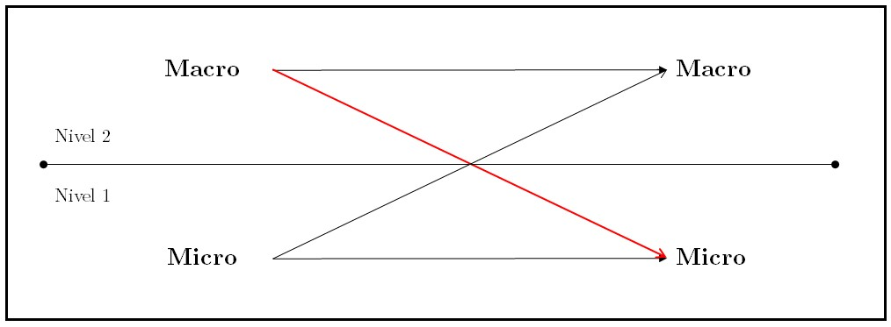
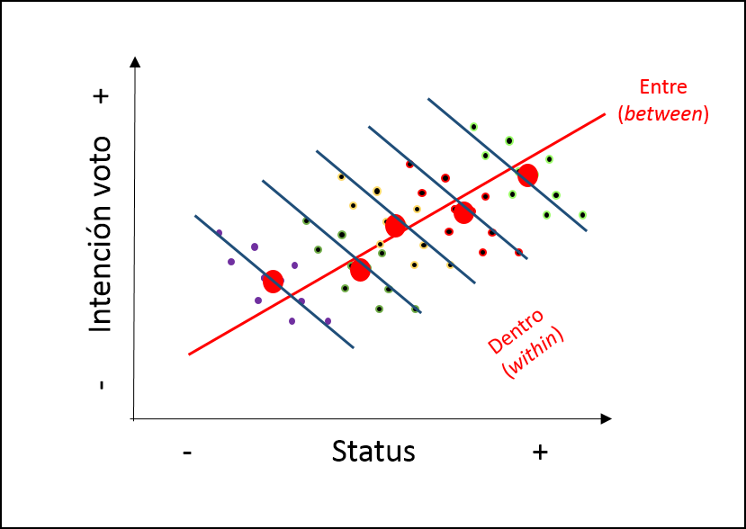
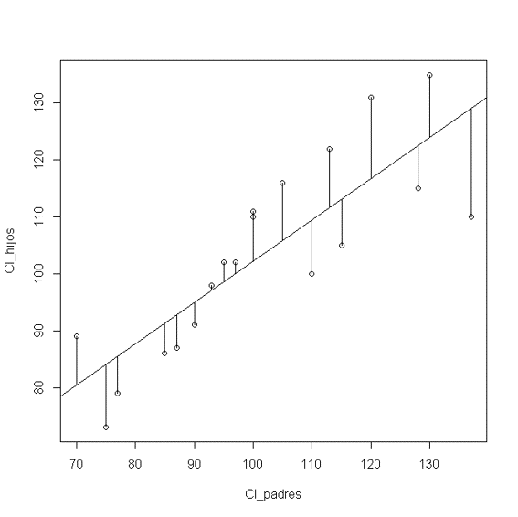
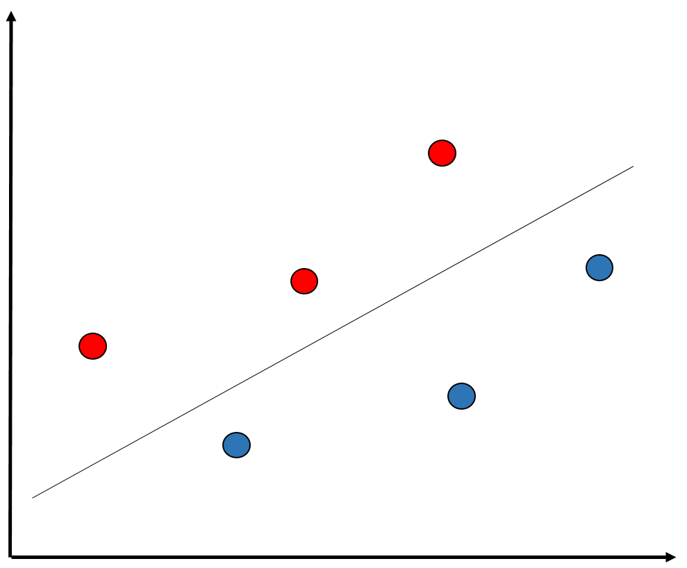
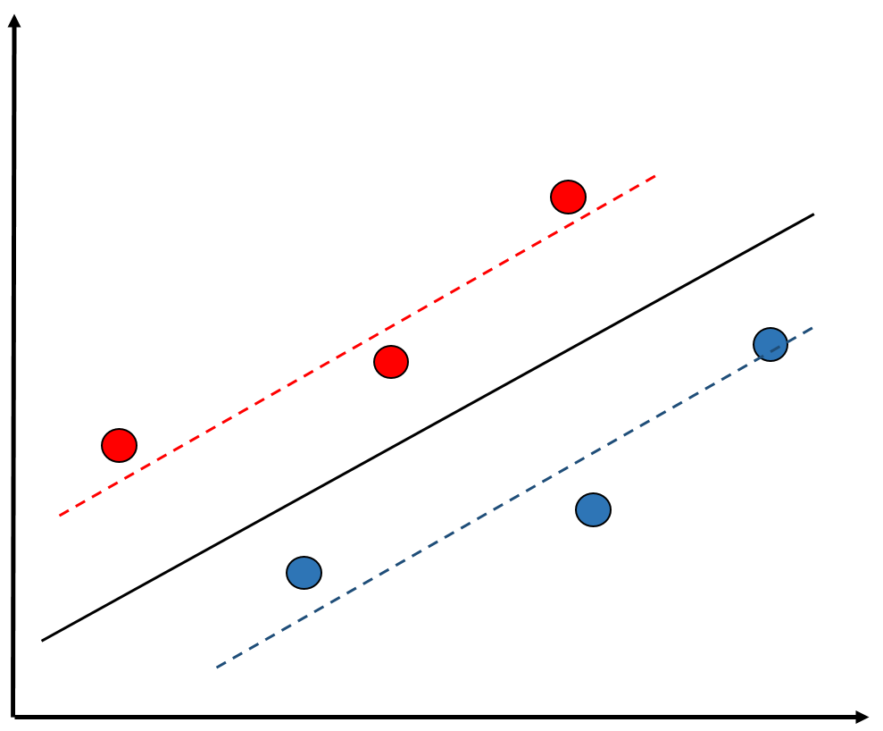
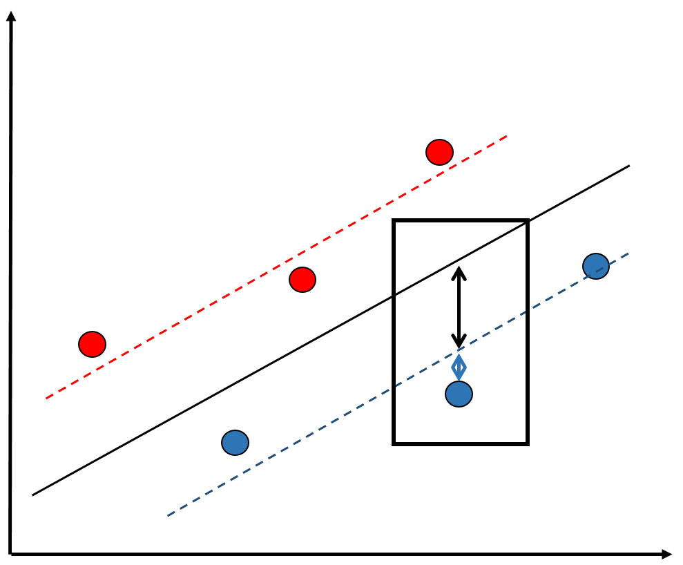
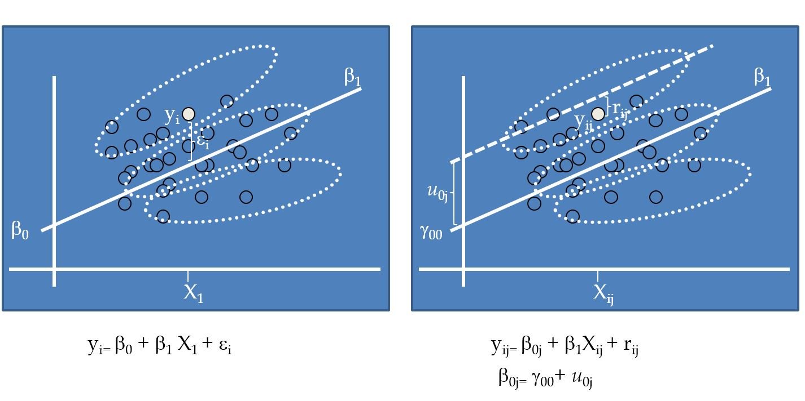

class: front


```{r setup, include=FALSE, cache = FALSE}
require("knitr")
opts_chunk$set(warning=FALSE,
             message=FALSE,
             echo=TRUE,
             cache = TRUE, fig.width=7, fig.height=5.2)
pacman::p_load(flipbookr, tidyverse)
```


```{r xaringanExtra, include=FALSE}
xaringanExtra::use_xaringan_extra(c("tile_view", "animate_css"))
xaringanExtra::use_scribble()
```

.pull-left-wide[
# Modelos multinivel]

.pull-right-narrow[]

## Unidades en contexto

----
.pull-left[

## Juan Carlos Castillo
## Sociología FACSO - UChile
## 2do Sem 2023 
## [.yellow[multinivel-facso.netlify.com]](https://multinivel-facso.netlify.com)
]
    

.pull-right-narrow[
.center[
.content-block-gray[
## Sesión 3: 
## **.yellow[Estimación en distintos niveles]**]
]
]
---

layout: true
class: animated, fadeIn

---
class: middle

#  - Lectura: Finch cap. 2: Introduction to Multilevel Data Structure
<br>
# - Práctico: Preparación de datos con R
---
class: roja right

# Contenidos


## .yellow[1- Resumen sesión anterior]

## 2- Regresión y residuos en contexto

## 3- Estimación con variables agregadas


---
# Resumen: Investigación sociológica y contexto


.right[
(adaptado de Coleman, 1986)]
`r Cite (bib, "Coleman1986SocialTheorySocial")`


---
# Datos anidados / con estructura jerárquica
----

| IDi | IDg | var_i1 | var_i2 | var_g1 | var_g2 |
|-----|-----|--------|--------|--------|--------|
| 1   | 1   | 8      | 7      | 4      | 1      |
| 2   | 1   | 5      | 5      | 4      | 1      |
| 3   | 1   | 3      | 1      | 4      | 1      |
| 4   | 2   | 3      | 2      | 6      | 8      |
| 5   | 2   | 1      | 4      | 6      | 8      |
| 6   | 2   | 7      | 5      | 6      | 8      |

---
## Problemas asociados a la inferencia con datos anidados

--

### Falacia ecológica:

- Conclusiones erradas acerca de individuos basados en datos de contexto

--

### Falacia individualista:

-   Conclusiones erradas acerca de contextos basados en datos de individuos


---
.pull-left-narrow[
# Falacia ecológica
]

.pull-right-wide[

]

---
# Formas de estimación multinivel

Modelo multinivel con predictores individuales (x)  y contextuales (z)


---
class: roja right

# Contenidos


## 1- Resumen sesión anterior

## .yellow[2- Regresión y residuos en contexto]

## 3- Estimación con variables agregadas


---
# Objetivos del modelo de regresión


1 - Conocer la .red[variación] de una variable (dependiente, Y) de acuerdo a la variación de otra variable (independiente, X):

  -   Ej: En qué medida el puntaje PSU influye en el éxito académico en la universidad? ...


---
# Objetivos del modelo de regresión


2 -  .red[Estimar] el valor de una variable de acuerdo al valor de otra
(predicción)

  -   Ej: Si una persona obtiene 600 puntos en la PSU, que promedio de notas en la universidad es probable que obtenga? 
  
(Atención: predicción no implica explicación)
  
---
# Objetivos del modelo de regresión

3 - Establecer en que medida esta asociación es .red[estadísticamente significativa] (inferencia)


---
## Bases 

$$\begin{aligned}
Varianza=\sigma^2 &= \frac{\sum_{i=1}^{n}(x_i - \bar{x})(x_i - \bar{x})} {n-1} =\frac{\sum_{i=1}^{n}(x_i - \bar{x})^2} {n-1} \\ \\
Covarianza= 
cov(x,y) &= \frac{\sum_{i=1}^{n}(x_i - \bar{x})(y_i - \bar{y})} {n-1}
\\ \\
Correlación=r &= \frac{\sum_{i=1}^{n}(x_i - \bar{x})(y_i - \bar{y})} {(n-1)\sigma_x \sigma_y }
\end{aligned}$$


---
# Regresión

.pull-left-wide[
-   La (co) variación general de Y respecto a X se puede expresar en una
ecuación de la recta = modelo de regresión

-   Para estimar la “mejor recta” se utiliza la *recta de mínimos
cuadrados* (OLS – Ordinary Least Squares)

- OLS es un estimador que minimiza la suma de
los cuadrados de las distancias entre las observaciones y la recta
en el eje vertical
]

.pull-right-narrow[

]

---
# Ecuación de regresión

### $$Y=a+\beta X + e$$

--

-   $a$= intercepto (o $\beta_0$), el valor de Y cuando X es 0

--

-   $b$= pendiente (coeficiente de regresión), es el valor que me permite
estimar el puntaje de Y mediante el puntaje de X

--

-   $e$= residuo, da cuenta de las fuentes de variabilidad distintas de X en la predicción de Y. O sea, es la parte de Y que no es explicada por X.


---
# Coeficientes de regresión

Estimación de los coeficientes de la ecuación:

$$\begin{aligned}
b=\frac{\Sigma xy}{\Sigma x^2}&=\frac{\Sigma((x-\bar{x})(y-\bar{y}))}{\Sigma (x-\bar{x})} \\ \\
a&=\bar{Y}-b \bar{X} \\ \\
{Y}^{\prime }&=a+bX
\end{aligned}$$


--
-   La ecuación de regresión permite predecir valores de Y para cada valor de X

---
# Descomposición de Y

.center[

]

\begin{align*}
SS_{tot}&=SS_{reg} + SS_{error} \\ 
\Sigma(y_i - \bar{y})^2&=\Sigma (\hat{y}_i-\bar{y})^2 +\Sigma(y_i-\hat{y}_i)^2
\end{align*}

---
# Descomposición de Y

$$\begin{aligned}
Y&=\bar{Y}+({Y}^{\prime}-\bar{Y})+(Y-{Y}^{\prime})\\\\
Y-\bar{Y}&=({Y}^{\prime}-\bar{Y}) + (Y-{Y}^{\prime}) \\\\
\Sigma(y_i - \bar{y})^2 &=\Sigma (\bar{y}-\hat{y}_i)^2 + \Sigma(y_i-\hat{y}_i)^2 \\\\
SS_{tot}&=SS_{reg}+SS_{error}
\end{aligned}$$


---
# Descomposición de Y


$$SS_{tot}=SS_{reg}+SS_{error}$$

$$\frac{SS_{tot}}{SS_{tot}}=\frac{SS_{reg}}{SS_{tot}}+\frac{SS_{error}}{SS_{tot}}$$

$$1= \frac{SS_{reg}}{SS_{tot}} + \frac{SS_{error}}{SS_{tot}} \\
\frac{SS_{reg}}{SS_{tot}}= ?$$

--

$$R^2$$

---
class: roja, middle, center

# Regresión con más de 1 nivel


---
## Residuos y dependencia contextual


---
## Residuos y dependencia contextual


---
## Residuos y dependencia contextual



---
## Residuos y dependencia contextual



---
# Implicancias para el modelo de regresión:

-   Situaciones en que los residuos son distintos de manera sistemática de acuerdo a variables contextuales: .red[dependencia (contextual) de los residuos]

- Si un modelo de regresión de 1 nivel se aplica en situaciones de dependiencia contextual, entonces puede aumentar el error en la estimación

---
# Alternativas

-   Descomposición de la varianza de los residuos *entre* y
*dentro* los grupos= en distintos niveles = **multinivel**.

-   En concreto, se agrega un término de error adicional al modelo:
$\mu_{0j}$

-   Este término de error se expresa como un **efecto aleatorio** (como opuesto a *efecto fijo*)


---
## Regresión a distintos niveles



---
## Modelo con coeficientes aleatorios (RCM)

-   Random Coefficients Models (RCM) o Mixed (effects) Models

-   Forma de estimación de modelos multinivel

-   Idea base: se agrega un parámetro *aleatorio* al modelo, es decir, que posee variación en relación a unidades de nivel 2.

---
class: roja right

# Contenidos


## 1- Resumen sesión anterior

## 2- Regresión y residuos en contexto

## .yellow[3- Estimación con variables agregadas]
---
## Práctica: High School & Beyond (HSB) data

  -   High School & Beyond (HSB) es una muestra representativa nacional de educación secundaria publica y católica de USA implementada por el National Center for Education Statistics (NCES).

-   Más información en [https://nces.ed.gov/surveys/hsb/](http://nces.ed.gov/surveys/hsb)

-   Level 1 variables:

  -   minority, etnicidad (1 = minority, 0 =other)

  -   female, student gender (1 = female, 0 = male)

  -   ses, (medida estandarizada de nivel socioeconómico en base a variables como educación de los padres, ocupación e ingreso)

  -   **mathach**, logro en matemática (_math achievement_)

---
## Práctica: High School & Beyond (HSB) data

-   Level 2 variables:

  -   size (matricula)

  -   sector (1 = Catholic, 0 = public)

  -   pracad (proportion of students in the academic track)

  -   disclim (a scale measuring disciplinary climate)

  -   himnty (1 = more than 40% minority enrollment, 0 = less than 40%)

  -   meanses (mean of the SES values for the students in this school who are included in the level-1 file)

-  **Cluster variable**= id (school id)


---
## Librerías y datos

```{r}
pacman::p_load(
haven,  # lectura de datos formato externo
car, # varias funciones, ej scatterplot
dplyr, # varios gestión de datos
stargazer, # tablas
corrplot, # correlaciones
ggplot2, # gráficos
lme4) # multilevel
```

.medium[
```{r, echo=TRUE}
mlm <-read_dta("http://www.stata-press.com/data/mlmus3/hsb.dta") # datos
```
]

---
## Ajuste datos

.medium[
```{r}
dim(mlm)
names(mlm)
```
]

---

# Seleccionar variables de interés

```{r}
mlm=mlm %>% select(
  minority,female,ses,mathach, # nivel 1
  size, sector,mnses,schoolid) %>%  # nivel 2
  as.data.frame()
```


---
## Nota: sobre `%>%`

- `%>%` es conocido como "pipe operator", operador pipa o simplemente pipa

- proviene de la librería `magrittr`, que es utilizada en `dplyr`

- objetivo: hacer más fácil y eficiente el código, incorporando varias funciones en una sola línea / comando

- avanza desde lo más general a lo más específico


---
## Descriptivos generales

.pull-left-narrow[
.medium[
```{r, eval=FALSE}
stargazer(
  as.data.frame(mlm),
  title = "Descriptivos generales", 
  type='text')
```
]
]

.pull-right-wide[
.small[
```{r, echo=FALSE}
stargazer(
  as.data.frame(mlm),
  title = "Descriptivos generales", 
  type='text')
```

]
]
---
## Descriptivos generales

```{r}
hist(mlm$mathach, xlim = c(0,30))
```

---
## Descriptivos generales

.pull-left[
```{r eval=FALSE}
scatterplot(mlm$mathach ~ 
  mlm$ses,
  data=mlm, 
  xlab="SES", 
  ylab="Math Score",
  main="Math on SES", 
  smooth=FALSE)
```
]

.pull-right[
```{r echo=FALSE}
scatterplot(mlm$mathach ~ mlm$ses,
  data=mlm, xlab="SES", ylab="Math Score",
  main="Math on SES", smooth=FALSE)
```
]
---
## Descriptivos generales

.medium[
```{r}
cormat=mlm %>%
  select(mathach,ses,sector,size, mnses) %>%
  cor()
round(cormat, digits=2)
```
]
---
## Descriptivos generales

```{r}
corrplot.mixed(cormat)
```

---
## Datos agregados

- Datos nivel 2:
  - propios/idiosincráticos (ej: tamaño)
  - agregados: generados a partir de datos nivel 1

--
- Una de las particularidades de los métodos multinivel es que permiten estimar y comparar efectos de la misma variable individual y agregada

- Ejemplo:
  - nivel socioeconómico individual
  - nivel socioeconómico de la escuela


--

- Para ello, se procede a "agregar", generando una base de datos a nivel 2


---
## Datos agregados

- Usando la funcion `group_by` (agrupar por) de la librería `dplyr`

- Se agrupa por la variable **cluster**, que identifica a las unidades de nivel 2 (en este caso, `schoolid`)
- Por defecto se hace con el promedio, pero se pueden hacer otras funciones como contar, porcentajes, mediana, etc.


---
# Generando base de datos agregados

```{r}
agg_mlm=mlm %>% group_by(schoolid) %>%
  summarise_all(funs(mean)) %>% as.data.frame()

```

  - generamos el objeto `agg_mlm` desde el objeto `mlm`

  - agrupando por la variable cluster `schoolid`

  - agregamos (colapsamos) todas `summarise_all` por el promedio `funs(mean)`

---
## Datos agregados

.medium[
```{r}
stargazer(agg_mlm, type = "text")
```
]

---
## Comparación Modelos

- Modelo con datos individuales

```{r}
reg<- lm(mathach~ses+female+sector, data=mlm)
```

- Modelo con datos agregados

```{r}
reg_agg<- lm(mathach~ses+female+sector, data=agg_mlm)
```

---

- Generación tabla

```{r eval=FALSE}
stargazer(reg,reg_agg,
  column.labels=c("Individual","Agregado"),
  type ='text')
```

---
## Comparación Modelos
.small[
```{r, echo=T}
pacman::p_load(sjPlot,sjmisc,sjlabelled)
tab_model(reg, reg_agg, show.ci=F, show.se = T, dv.labels = c("Individual", "Agregado"))

```
]

---
class: roja, middle, center

# ¿Qué problema puede haber al estimar un mismo modelo para variables individuales y agregadas?


---
class: front
.pull-left-wide[
# Modelos multinivel]

.pull-right-narrow[]

## Unidades en contexto

----
.pull-left[

## Juan Carlos Castillo
## Sociología FACSO - UChile
## 2do Sem 2023 
## [.yellow[multinivel-facso.netlify.com]](https://multinivel-facso.netlify.com)
]
    

.pull-right-narrow[
.center[

]
]
