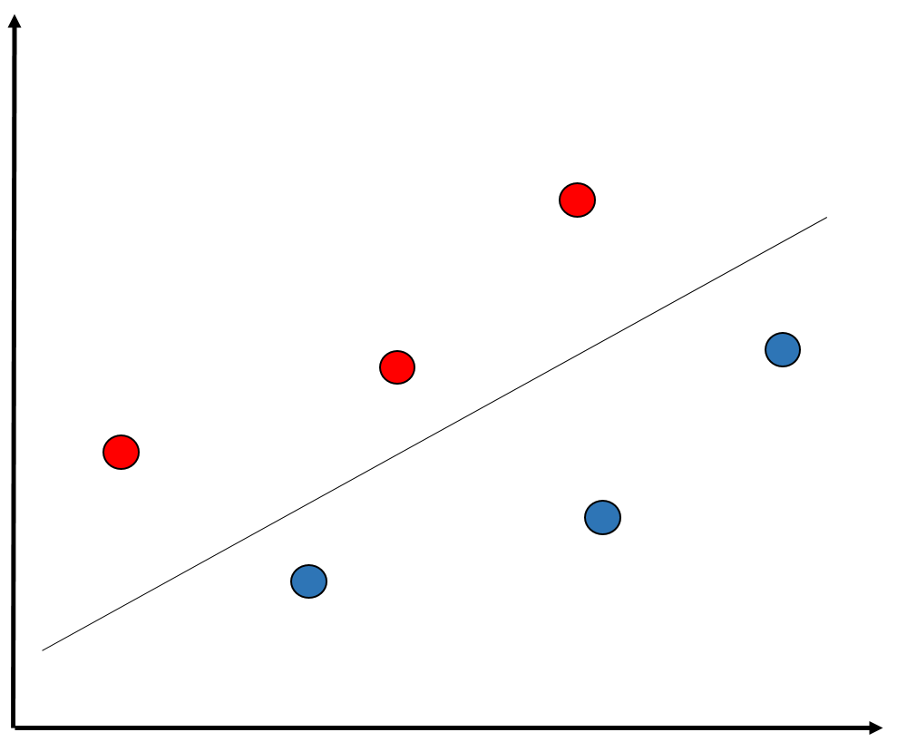
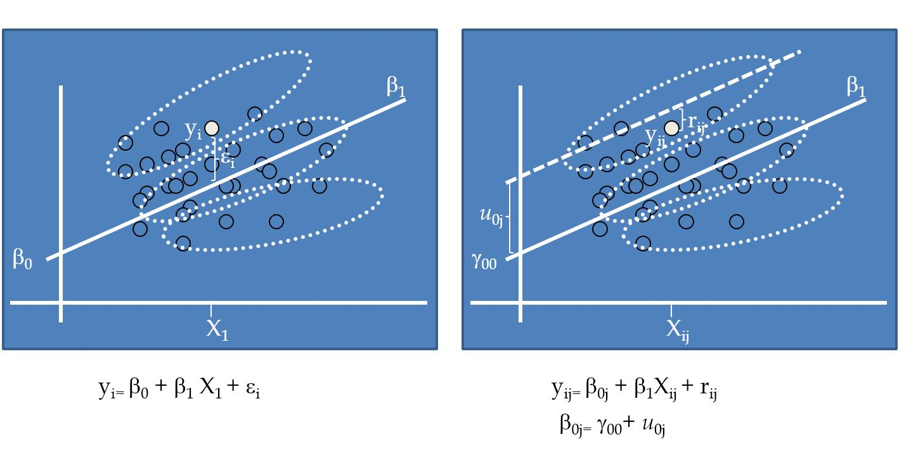
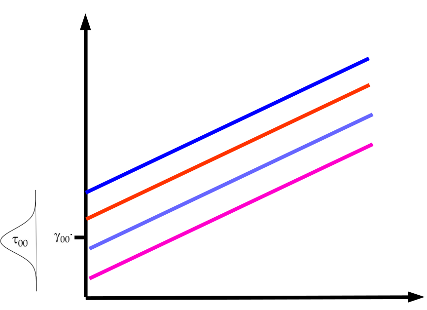

class: front


```{r setup, include=FALSE, cache = FALSE}
require("knitr")
opts_chunk$set(warning=FALSE,
             message=FALSE,
             echo=TRUE,
             cache = TRUE, fig.width=7, fig.height=5.2)
pacman::p_load(flipbookr, tidyverse)
```


```{r xaringanExtra, include=FALSE}
xaringanExtra::use_xaringan_extra(c("tile_view", "animate_css"))
xaringanExtra::use_scribble()
```

.pull-left-wide[
# Modelos multinivel]

.pull-right-narrow[]

## Unidades en contexto

----
.pull-left[

## Juan Carlos Castillo
## Sociología FACSO - UChile
## 2do Sem 2023 
## [.yellow[multinivel-facso.netlify.com]](https://multinivel-facso.netlify.com)
]
    

.pull-right-narrow[
.center[
.content-block-gray[
## Sesión 4: 
## **.yellow[Correlación intra clase y estimación MLM]**]
]
]
---

layout: true
class: animated, fadeIn

---
class: middle

#  - Lectura: Finch cap. 3: Fitting Two-Level Models in R
<br>
# - Práctico
---
class: roja right

.pull-left-narrow[
# Contenidos
]

## .yellow[1- Resumen sesión anterior]

## 2- Modelos y pasos

## 3- Correlación intra-clase

## 4- Estimación en R

---
## Residuos y dependencia contextual


---
## Residuos y dependencia contextual


---
## Residuos y dependencia contextual


---
## Modelo con coeficientes aleatorios (RCM)

-   Random Coefficients Models (RCM) o Mixed (effects) Models

-   Forma de estimación de modelos multinivel

-   Idea base: se agrega un parámetro *aleatorio* $\mu_j$ al modelo, es decir, que posee variación en relación a unidades de nivel 2.

---
```{r echo=FALSE}
pacman::p_load(
haven,  # lectura de datos formato externo
car, # varias funciones, ej scatterplot
dplyr, # varios gestión de datos
stargazer, # tablas
corrplot, # correlaciones
ggplot2, # gráficos
lme4) # multilevel

mlm <-read_dta("http://www.stata-press.com/data/mlmus3/hsb.dta") # datos

mlm=mlm %>% select(
  minority,female,ses,mathach, # nivel 1
  size, sector,mnses,schoolid) %>%  # nivel 2
  as.data.frame()

agg_mlm=mlm %>% group_by(schoolid) %>%
  summarise_all(funs(mean)) %>% as.data.frame()
```

## Comparación Modelos

- Modelo con datos individuales

```{r}
reg<- lm(mathach~ses+female+sector, data=mlm)
```

- Modelo con datos agregados

```{r}
reg_agg<- lm(mathach~ses+female+sector, data=agg_mlm)
```

---
## Comparación Modelos
.small[
```{r, echo=T}
pacman::p_load(sjPlot,sjmisc,sjlabelled)
tab_model(reg, reg_agg, show.ci=F, show.se = T, dv.labels = c("Individual", "Agregado"))

```
]
---
## Implicancias estimación individual/agregada

- diferencias entre los coeficientes: riesgo de falacia ecológica / individualista

  - inflación de errores estándar para variables nivel 1 estimadas como agregadas, ej: female agregado (riesgo error tipo II)

  - contracción de errores estándar para variables nivel 2 estimadas como individuales, ej: sector individual (error tipo I)
---
class: middle

## Alternativa: 
  # Modelo que ajuste errores estándar según el tipo de variable nivel 1 y nivel 2 
  # = MULTINIVEL

---
class: roja right

.pull-left-narrow[
# Contenidos
]

## 1- Resumen sesión anterior

## 2- .yellow[Modelos y pasos]

## 3- Correlación intra-clase

## 4- Estimación en R


---
# Pasos (usuales) en la estimación del modelo
 
 0  Modelo nulo

1.  Modelo con variables individuales

2.  Modelo con variables contextuales

3.  Modelo con variables individuales y contextuales

4.  Modelo con pendiente (individual) aleatoria

5.  Modelo con variables individuales, contextuales e interacción entre
    niveles (cross-level interaction)
---
## 0.Modelo nulo


---
## 1.Modelo con variable independiente individual


---
## 2.Modelo con variable independiente grupal


---
## 3.Modelo con variable independiente individual y grupal


---
## 4.Modelo con pendiente aleatoria


---
## 4.Modelo con pendiente aleatoria


---
## 5.Modelo con interacción entre niveles


---
## 5.Modelo con interacción entre niveles


"La relación entre X e Y varía entre contextos, y esta variación se asocia a una característica del contexto"

- *Ej*: la influencia del nivel socioeconómico en rendimiento en lenguaje es moderada por la presencia de bibliotecas en las escuelas

---
class: roja right

.pull-left-narrow[
# Contenidos
]

## 1- Resumen sesión anterior

## 2- Modelos y pasos

## 3- .yellow[Correlación intra-clase]

## 4- Estimación en R


---
class: roja, middle, center

# ¿Qué problema puede haber al estimar un mismo modelo para variables individuales y agregadas?

---
## Parámetros




---
# Descomposición de la varianza

 Idea base de modelos multinivel: .red[la varianza de la variable dependiente se puede descomponer en distintos niveles]:

  - varianza Nivel 1: dentro o "within", en relación al promedio individual

  - varianza Nivel 2: entre o "between", en relación al promedio de los grupos
  
  - varianza Nivel $j$ ...

---
.pull-left-narrow[# Descomposición de la varianza
]

.pull-right-wide[


$$var_{tot}=var_{dentro}+var_{entre}$$
]

---
class: middle

.pull-left-narrow[
# Varianzas y predictores]


---
# Componentes de la varianza

-   Los efectos aleatorios asumen una varianza (estimada) en base a una
    distribución normal

-   Permiten calcular la correlación intra-clase y distintas medidas de ajuste de los modelos

---
# Componentes de la varianza

  -   $var \ r_{ij}=\sigma^2$ (varianza residuos nivel individual)
  
  -   $var \ \mu_{0j}= \tau_{00} = \tau_0^2$ (varianza asociada a
    intercepto aleatorio)
  
  -   $var \ \mu_{1j}= \tau_{11} = \tau_1^2$ (varianza asociada a
    pendiente aleatoria)
  
  -   $cov (\tau_{00},\tau_{11})= \tau_{01}$ (covarianza entre intercepto
    y pendiente)

---
# Componentes de la varianza


---
# Componentes de la varianza


  
---
## Correlación intra clase: ICC

-   La correlación intra-clase ( $\rho$ ) indica qué porcentaje de la
    varianza de la variable dependiente se debe a pertenencia a unidades     de nivel 2

-   Descomposición de la varianza en modelo nulo=
    $Var\ y=\tau_{00} + \sigma^2$

-   Es decir, parte de la varianza se debe a los individuos ( $\sigma^2$ )
    y parte al grupo ( $\tau_{00}$ )

---
## Correlación intra clase: ICC

-   Correlación intra-clase = ICC =


# $$\rho=\frac{\tau_{00}}{\tau_{00}+\sigma^2}$$

-   Una ICC **baja** indica baja variabilidad de la
    variable dependiente entre unidades de nivel 2, y por lo tanto, menores posibilidades de dar cuenta (*explicar*) de esa varianza con
    predictores de nivel 2.


---
class: roja, middle, center

# Correlación intra-clase

## "Proporción de la varianza de la variable dependiente que se asocia a la pertenencia a unidades de nivel 2"


---
class: roja right

.pull-left-narrow[
# Contenidos
]

## 1- Resumen sesión anterior

## 2- Modelos y pasos

## 3- Correlación intra-clase

## 4- .yellow[Estimación en R]


---
# librería lme4

-   función lmer (linear mixed effects)

-   forma general:

    -   `objeto <- lmer (depvar ~ predictor_1 + predictor_2 + predictor_n + (1 | cluster), data=data)`

    -   el objeto contiene la información de la estimación; para ver un resumen, `summary(objeto)`, y de manera más presentable,`screenreg(objeto)`


---
# Ejemplo Estimación en R


## -> Práctica


---
class: front
.pull-left-wide[
# Modelos multinivel]

.pull-right-narrow[]

## Unidades en contexto

----
.pull-left[

## Juan Carlos Castillo
## Sociología FACSO - UChile
## 2do Sem 2023 
## [.yellow[multinivel-facso.netlify.com]](https://multinivel-facso.netlify.com)
]
    

.pull-right-narrow[
.center[

]
]
