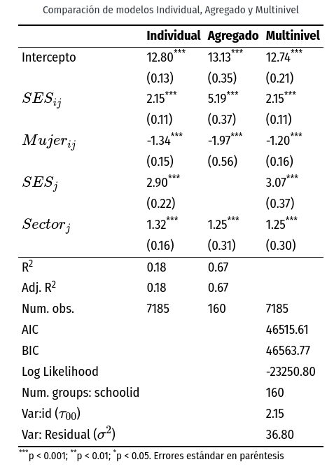
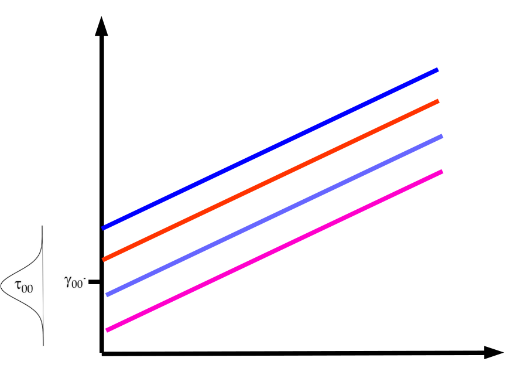
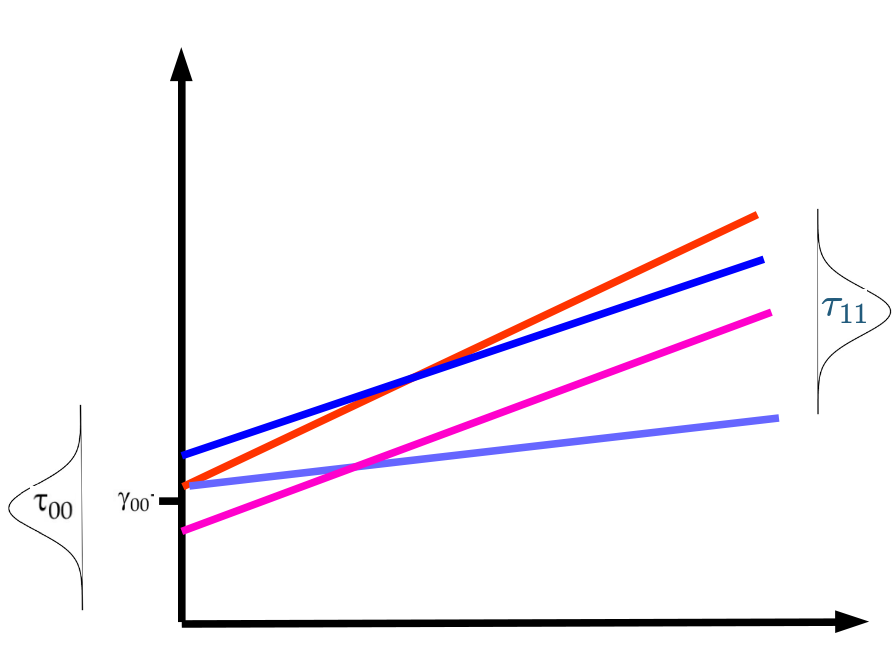

class: front


```{r setup, include=FALSE, cache = FALSE}
require("knitr")
opts_chunk$set(warning=FALSE,
             message=FALSE,
             echo=TRUE,
             cache = TRUE, fig.width=7, fig.height=5.2)
pacman::p_load(flipbookr, tidyverse)
```


```{r xaringanExtra, include=FALSE}
xaringanExtra::use_xaringan_extra(c("tile_view", "animate_css"))
xaringanExtra::use_scribble()
```

.pull-left-wide[
# Modelos multinivel]

.pull-right-narrow[]

## Unidades en contexto

----
.pull-left[

## Juan Carlos Castillo
## Sociología FACSO - UChile
## 2do Sem 2023 
## [.yellow[multinivel-facso.netlify.com]](https://multinivel-facso.netlify.com)
]
    

.pull-right-narrow[
.center[
.content-block-gray[
## Sesión 5: 
## **.yellow[Ajuste y reporte]**]
]
]
---

layout: true
class: animated, fadeIn

---
class: middle

# Lecturas
	
## - O’Conell & McCoach 7, Evaluating model fit and adequacy

## - O’Conell & McCoach 11, Reporting results from multilevel

# Práctico

---
class: roja right
# Contenidos


## .yellow[1- Resumen sesión anterior]

## 2- Ajuste

## 3- Reporte

---
```{r echo=FALSE}
pacman::p_load(
haven,  # lectura de datos formato externo
car, # varias funciones, ej scatterplot
dplyr, # varios gestión de datos
stargazer, # tablas
corrplot, # correlaciones
ggplot2, # gráficos
lme4) # multilevel

mlm <-read_dta("http://www.stata-press.com/data/mlmus3/hsb.dta") # datos

mlm=mlm %>% select(
  minority,female,ses,mathach, # nivel 1
  size, sector,mnses,schoolid) %>%  # nivel 2
  as.data.frame()

agg_mlm=mlm %>% group_by(schoolid) %>%
  summarise_all(funs(mean)) %>% as.data.frame()
```

## Comparación Modelos

- Modelo con datos individuales

```{r}
reg<- lm(mathach~ses+female+sector, data=mlm)
```

- Modelo con datos agregados

```{r}
reg_agg<- lm(mathach~ses+female+sector, data=agg_mlm)
```

---
## Comparación Modelos
.small[
```{r, echo=T}
pacman::p_load(sjPlot,sjmisc,sjlabelled)
tab_model(reg, reg_agg, show.ci=F, show.se = T, dv.labels = c("Individual", "Agregado"))

```


]

---
.pull-left[

]

.pull-right[

--> (del último [práctico](https://multinivel-facso.netlify.app/assignment/03-practico))
<br>
##¿Qué podemos decir de esta tabla?
]

---
## Implicancias estimación individual/agregada
----
.pull-left[

  - .red[inflación] de errores estándar para variables nivel 1 estimadas como agregadas, ej: female agregado (riesgo error tipo II) -> .red[no detectar un efecto cuando este existe]
]

.pull-right[
  - .red[contracción] de errores estándar para variables nivel 2 estimadas como individuales, ej: sector individual (error tipo I) -> .red[detectar un efecto cuando este no existe]
]
---
# Componentes de la varianza


---
# Componentes de la varianza




  
---
## Correlación intra clase: ICC

-   La correlación intra-clase ( $\rho$ ) indica qué porcentaje de la
    varianza de la variable dependiente se debe a pertenencia a unidades     de nivel 2

-   Descomposición de la varianza en modelo nulo=
    $Var\ y=\tau_{00} + \sigma^2$

-   Es decir, parte de la varianza se debe a los individuos ( $\sigma^2$ )
    y parte al grupo ( $\tau_{00}$ )

---
## Correlación intra clase: ICC

-   Correlación intra-clase = ICC =


# $$\rho=\frac{\tau_{00}}{\tau_{00}+\sigma^2}$$

-   Una ICC **baja** indica baja variabilidad de la
    variable dependiente entre unidades de nivel 2, y por lo tanto, menores posibilidades de dar cuenta (*explicar*) de esa varianza con
    predictores de nivel 2.

---
class: roja, middle, center

# Correlación intra-clase

## "Proporción de la varianza de la variable dependiente que se asocia a la pertenencia a unidades de nivel 2"


---
# librería lme4

-   función lmer (linear mixed effects)

-   forma general:

    -   `objeto <- lmer (depvar ~ predictor_1 + predictor_2 + predictor_n + (1 | cluster), data=data)`

    -   el objeto contiene la información de la estimación; para ver un resumen, `summary(objeto)`, y de manera más presentable,`screenreg(objeto)`


---
class: roja right
# Contenidos


## 1- Resumen sesión anterior

## .yellow[2- Ajuste]

## 3- Reporte

---
# Tipos de medidas de ajuste

1. Medidas relativas a la varianza de efectos aleatorios (tipo $R^2$)

2. Medidas de fit comparativo (deviance)

---
##  Ajuste por proporción de varianzas


---
# Estimación de modelos para el ejemplo:

results_0: nulo
results_1: agrega predictores individuales (nivel 1)
results_2: agrega predictores grupales (nivel 2)


```{r}
results_0 <-lmer(mathach ~ 1 + (1 | schoolid), data = mlm)
results_1 <-lmer(mathach ~ 1 + ses + female + (1 | schoolid), data = mlm)
results_2 <-lmer(mathach ~ 1 + sector + mnses + (1 | schoolid), data = mlm)
```


---
# Ajuste por proporción de varianzas

-   Se relacionan con el grado de varianza “explicada” (disminución en la(s) varianza(s) atribuida a la inclusión de predictores en el modelo de regresión)

-   Controversia en la literatura de multinivel, no existe una medida única

-   Las propuestas sugieren usualmente cálculos de $R^2$ para cada nivel

---
## Bryck & Raudenbush R2 multinivel (1992)

- lógica general: calcular la diferencia entre componentes de la varianza entre los modelos estimados

- modelo base para la comparación: modelo nulo

- luego, a medida que se agregan modelos, se compara en que medida los componentes de la varianza van disminuyendo a medida que se agregan predictores


---
## Componentes de la varianza del ejemplo modelos con HSB data
----
.medium[

  | $\sigma^2$   | $\tau_{00}$ 
--|----------|-----|-----
Modelo 0  (nulo, sin predictores)                 |  39.148   | 8.553  
Modelo 1 (predictores ind.)    |  36.813   |  4.492 
Modelo 2 (predictores grup.)   |  39.161   |  2.314 

]

- Los componentes de la varianza van disminuyendo a medida que se ingresan predictores a los modelos

- Por ejemplo, en el modelo 1 el componente de la varianza individual $\sigma^2$ disminuye en comparación al modelo nulo: .red[39.148-36.813=2.335] - ¿Cómo interpretar esto?


---
## Bryk & Raudenbush - R2 Nivel 1

.pull-left[


Para Nivel 1: 

<br>

$$\begin{split}
   R^2_{1B\&R}&=\frac{var_0(r_{ij})-var_f(r_{ij})}{var_0(r_{ij})} \\\\
    &=\frac{\sigma^2(0)-\sigma^2(f)}{\sigma^2(0)}
    \end{split}$$
]

.pull-right[
<br>
Donde:

-   $0$ se refiere al modelo nulo

-   $f$ se refiere a un modelo posterior
]

---
## Bryk & Raudenbush - R2 Nivel 1
----
.medium[

  | $\sigma^2$   | $\tau_{00}$ |  $R^2_{L1}$ |  $R^2_{L2}$
--|----------|-----|-----|--
Modelo 0                   |  39.148   | 8.553 |   |
Modelo 1 (predict.ind.)    |  36.813   |  4.492 | 0.059 |
Modelo 2 (predict.grup.)   |  39.161   |  2.314 |     |
]

Ej: $R^2_{L1}=(39.148-36.813)/39.148=2.335/39.148=0.059$


---
## Bryck & Raudenbush - R2 Nivel 2

.pull-left[

Para Nivel 2: 

<br>

$$\begin{split}
   R^2_{2B\&R}&=\frac{var_0(\mu_{0j})-var_f(\mu_{0j})}{var_0(\mu_{0j})} \\\\
    &=\frac{\tau_{00}(0)-\tau_{00}(f)}{\tau_{00}(0)}
    \end{split}$$
]

.pull-right[
<br>
Donde:

-   $0$ se refiere al modelo nulo

-   $f$ se refiere a un modelo posterior
]
---
## Bryck & Raudenbush - R2 Nivel 2
----
.medium[

  | $\sigma^2$   | $\tau_{00}$ |  $R^2_{L1}$ |  $R^2_{L2}$
--|----------|-----|-----|--
Modelo 0                   |  39.148   | 8.553 |   |
Modelo 1 (predict.ind.)    |  36.813   |  4.492 | 0.059 |   
Modelo 2 (predict.grup.)   |  39.161   |  2.314 |  0.00 |0.73 
]

Ej: $R^2_{L2}=(8.553-2.314)/8.553=6.239/8.553=0.73$

-   Recordar interpretación en relación a correlación intra-clase (para
    el caso de HSB data= 0.18): para el caso del R2 nivel 2 se está dando cuenta del 73% del 18%


---
# Cálculo directo con R - modelo 1

función `multilevel.r2`, librería [`misty`](https://search.r-project.org/CRAN/refmans/misty/html/multilevel.r2.html)

```{r}
pacman::p_load(misty)# for multilevel R2
misty::multilevel.r2(results_1, print = "RB")
```
---
# Cálculo directo Bryk & Raudenbush  con R - modelo 2

función `multilevel.r2`, librería [`misty`](https://search.r-project.org/CRAN/refmans/misty/html/multilevel.r2.html)

```{r}
pacman::p_load(misty)# for multilevel R2
misty::multilevel.r2(results_2, print = "RB")
```

---
# Nakagawa and Schielzeth R2 (2013)

- dos R2:

  - marginal: para los efectos fijos del modelo
  
  - condicional: para el modelo con efectos fijos y aleatorios
  
- utiliza la varianza de los valores predichos de la variable dependiente

---
# Nakagawa and Schielzeth R2 (2013)

- marginal (efectos fijos):
$$R^2_m=\frac{var(\hat{Y}_{ij})}{var(\hat{Y}_{ij})+\tau_{00}+\sigma^2}$$ 
- condicional (efectos fijos + aleatorios)
$$R^2_c=\frac{var(\hat{Y}_{ij})+\tau_{00}}{var(\hat{Y}_{ij})+\tau_{00}+\sigma^2}$$
---
# Cálculo directo Nakagawa  con R - modelo 2


```{r}
misty::multilevel.r2(results_2, print = "NS")
```

---
## 2. Ajuste comparativo

### Deviance test

-   El test o estadístico de deviance **compara el ajuste** de dos modelos
    basado en la log verosimilitud de cada modelo

-   La hipótesis a contrastar es si predictores adicionales del modelo
    mejoran o no el ajuste

-   Asume que los **modelos son anidados**, es decir, que un modelo con
    menos predictores puede ser derivado del modelo mayor mediante la
    fijación de ciertos coeficientes como 0.

-   Deviance= $-2*LL$ (LL=Log Likelihood)

-   Deviance test= $deviance(anidado)-deviance(mayor)$

---
## 2. Ajuste comparativo

### Deviance test

-   La distribución del estadístico de devianza es $\chi^2$, y los
    grados de libertad para calcular el valor crítico equivalen al
    número de parámetros extra en el modelo mayor

-   Es decir, parámetros modelo mayor - parámetros modelo inicial (o
    anterior)

-   Se utiliza con estimación ML en lugar de REML (restricted maximum likelihood).

---
## Ejemplo deviance

```{r, echo=FALSE}
attach(mlm)
```

.small[
```{r, eval=FALSE}
results_0ml = lmer(mathach ~ 1 + (1 | schoolid), REML=FALSE)
results_1ml = lmer(mathach ~ 1 + minority + ses + (1 | schoolid), REML=FALSE)
```

  | LL  | deviance | Parámetros
--|---|---|
results_0ml  | -23557.91 | 47115.81 |
results_1ml  | -23221.82 | 46443.64 | 2
]
-   Deviance test= 47115.8-46443.64= 672.16, 2 DF (2 parámetros
    adicionales)

---
## Ejemplo deviance

-   Valor crítico $\chi^2_{DF=2}$ para $p<0.95=5.99$

-   Por lo tanto, se rechaza $H_0$, es decir, las diferencias entre los
    modelos son distintas de 0 ( $p<0.05$ ). En otras palabras, el modelo
    con más parámetros presenta un mejor ajuste.

---
## Ejemplo deviance II - de manera directa en R:

```{r eval=FALSE}
anova(results_0ml,results_1ml)
```

Y para reportar:

.small[
```{r, results='asis'}
print(xtable::xtable(anova(results_0ml,results_1ml)), type="html")
```
]
---
#Ajuste y modelos con pendiente aleatoria

-  Los test de ajuste por proporción de varianza (R2) no son recomendados al momento de estimar modelos con pendiente aleatoria

-   El test de deviance se utiliza al momento de reportar la significancia de los efectos aleatorios (ej: con pendiente aleatorio,comparando el mismo modelo con y sin aleatorización)

-   Considerar que los componentes de la varianza son parámetros del modelo, es decir, se cuentan para la diferencia de grados de libertad


---
class: roja right

# Contenidos

## 1- Resumen sesión anterior

## 2- Ajuste

## .yellow[3- Reporte]

---
## Tablas y descriptivos

-   Tabla de descriptivos de variables L1 y L2

  - para esto conviene generar base de datos agregados para tabla descriptiva
  
  - se recomienda utilizar librería summarytools, función dfSummary (información [aquí](https://cran.r-project.org/web/packages/summarytools/vignettes/introduction.html))

-   Descripción del número de casos por nivel y también de otras    variables relevantes (ej, dependiente e independientes comprometidas en hipótesis)

---
.small[
```{r }
sjmisc::descr(mlm,
      show = c("label","range", "mean", "sd", "NA.prc", "n"))%>%
      kable(.,digits =2,"markdown")
```
]

---
class: middle

# Problema tabla anterior: aparecen en conjunto variables de nivel 1 y nivel 2, tienen distinto N y deberían presentarse por separado


---
.small[
```{r }
mlm %>%  select (mathach, ses, female, minority) %>% sjmisc::descr(.,
      show = c("label","range", "mean", "sd", "NA.prc", "n"))%>%
      kable(., digits =2, "markdown", caption = "Variables nivel 1")  
```
]

---
.small[
```{r }
agg_mlm %>%  select (size, sector,mnses) %>% sjmisc::descr(.,
      show = c("label","range", "mean", "sd", "NA.prc", "n"))%>%
      kable(., digits =2, "markdown", caption = "Variables nivel 2")  
```
]


---
## Descriptivos

### Ejemplo tabla descriptiva (Ferron et al 2007, en O’Connell Cap.11)

.center[]

Alternativas en R: Stargazer, [summarytools](https://cran.r-project.org/web/packages/summarytools/vignettes/Introduction.html)

---

### Reporte modelos


(O’Connell, cap.11)
---
## Reporte modelos


---
## Reporte modelos

-   Efectos fijos, con valores t o se

-   Asteriscos para niveles de significación

-   Efectos aleatorios

-   Fit: log likelihood

-   Fit adicionales: AIC, BIC, deviance, R2

---


.pull-left[
## Reporte con tab_model

```{r, eval=FALSE}
tab_model(results_1, results_2, 
  show.ci = FALSE, 
  show.se = TRUE, 
  collapse.se = TRUE,
  show.p = FALSE,
  p.style = c("scientific_stars")
  ) 
```
]

.pull-right[
.tiny[
```{r, echo=FALSE}
tab_model(results_2, 
  show.ci = FALSE, 
  show.se = TRUE, 
  collapse.se = TRUE,
  show.p = FALSE,
  p.style = c("scientific_stars")
  )
```
]]

---
# Reportes de relaciones bivariadas

- tablas cruzadas
- correlaciones / corrplot
- nubes de puntos

Revisar:

- [https://multivariada.netlify.app/assignment/02-code/](https://multivariada.netlify.app/assignment/02-code/)

- [https://correlacional.netlify.app/assignment/03-practico](https://correlacional.netlify.app/assignment/03-practico)

---
# Automatizando el reporte con RMarkdown
.medium[
- Markdown es un lenguaje de escritura de texto simple, con pocas marcas de edición.

- RMarkdown es un formato que permite vincular escritura en Markdown y código de R, que luego son compilados en diferentes formatos de salida (pdf, html, word) mediante la librería knitr


- Este proceso se encuentra automatizado en RStudio, mediante el uso del boton "Knitr", que realiza la compilación y muestra el output.
]
---

.pull-left[
## Ventajas

- permite generar tablas y gráficos automáticamente en el mismo documento, evitando el cortar / pegar

- escritura simple]

.pull-right[
## Desventajas

- acostumbrarse

- conformarse con un formato simple de texto (al menos inicialmente)

- ... igual es R]

<br>
.center[
#  VALE LA PENA
]

---

## RMarkdown

Tres cosas básicas a aprender:

- Markdown

- Insertar trozos (chunks) de código

- Opciones generales en encabezado YAML

---

## Varios tutoriales ... revisar

- Sección R Markdown de R4DS: https://es.r4ds.hadley.nz/r-markdown.html

- Guía de documentos dinámicos: https://juancarloscastillo.github.io/metsoc-facsouchile/documents/trabajos/guia_rep_dinamico/reportedinamico.html

- [https://correlacional.netlify.app/assignment/01-practico](https://correlacional.netlify.app/assignment/01-practico)

---
## ... y en RStudio


---
## Y en general para la entrega de trabajos

- De preferencia en (R)Markdown/html, facilita la apertura y colaboración.

- Preocuparse más del contenido que del formato


---
class: front
.pull-left-wide[
# Modelos multinivel]

.pull-right-narrow[]

## Unidades en contexto

----
.pull-left[

## Juan Carlos Castillo
## Sociología FACSO - UChile
## 2do Sem 2023 
## [.yellow[multinivel-facso.netlify.com]](https://multinivel-facso.netlify.com)
]
    

.pull-right-narrow[
.center[

]
]
