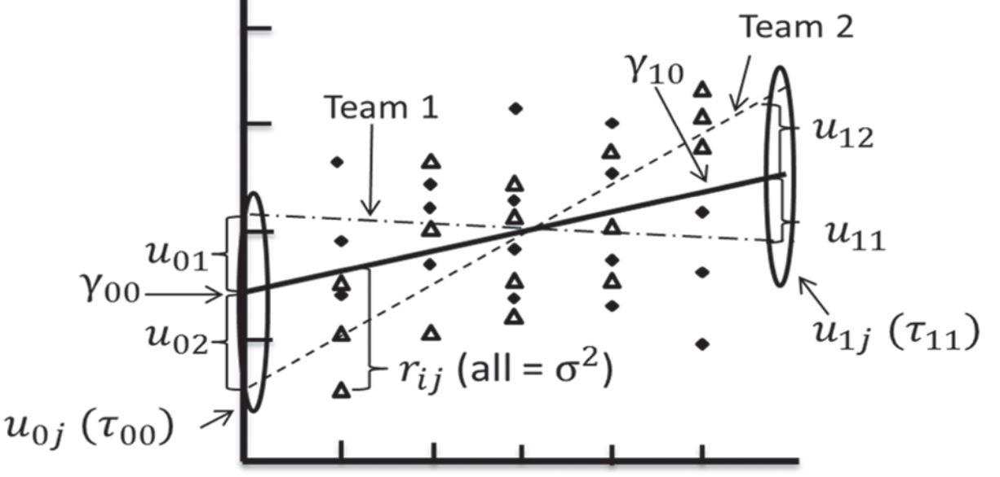
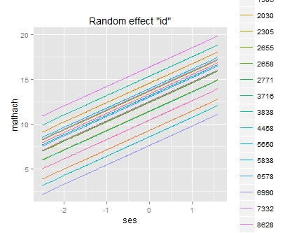
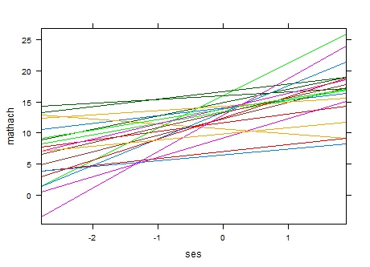
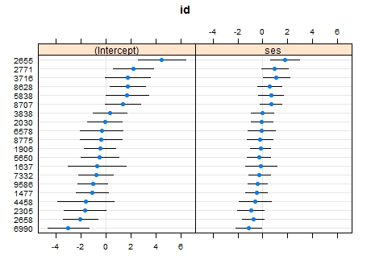

class: front


```{r setup, include=FALSE, cache = FALSE}
require("knitr")
opts_chunk$set(warning=FALSE,
             message=FALSE,
             echo=TRUE,
             cache = TRUE, fig.width=7, fig.height=5.2)
pacman::p_load(flipbookr, tidyverse)
```


```{r xaringanExtra, include=FALSE}
xaringanExtra::use_xaringan_extra(c("tile_view", "animate_css"))
xaringanExtra::use_scribble()
```

.pull-left-wide[
# Modelos multinivel]

.pull-right-narrow[]

## Unidades en contexto

----
.pull-left[

## Juan Carlos Castillo
## Sociología FACSO - UChile
## 2do Sem 2023 
## [.yellow[multinivel-facso.netlify.com]](https://multinivel-facso.netlify.com)
]
    

.pull-right-narrow[
.center[
.content-block-gray[
## Sesión 6: 
## **.yellow[Predicción de efectos aleatorios]**]
]
]
---

layout: true
class: animated, fadeIn

---
class: roja right
# Contenidos


## .yellow[1- Resumen sesión anterior]

## 2- Predicción de efectos aleatorios


```{r echo=FALSE}
pacman::p_load(
haven,  # lectura de datos formato externo
car, # varias funciones, ej scatterplot
dplyr, # varios gestión de datos
stargazer, # tablas
corrplot, # correlaciones
ggplot2, # gráficos
lme4) # multilevel

mlm <-read_dta("http://www.stata-press.com/data/mlmus3/hsb.dta") # datos

mlm=mlm %>% select(
  minority,female,ses,mathach, # nivel 1
  size, sector,mnses,schoolid) %>%  # nivel 2
  as.data.frame()

agg_mlm=mlm %>% group_by(schoolid) %>%
  summarise_all(funs(mean)) %>% as.data.frame()
```
---
# Componentes de la varianza


---
# Componentes de la varianza


  
---
## Correlación intra clase: ICC

-   La correlación intra-clase ( $\rho$ ) indica qué porcentaje de la
    varianza de la variable dependiente se debe a pertenencia a unidades     de nivel 2

-   Descomposición de la varianza en modelo nulo=
    $Var\ y=\tau_{00} + \sigma^2$

-   Es decir, parte de la varianza se debe a los individuos ( $\sigma^2$ )
    y parte al grupo ( $\tau_{00}$ )

---
class: roja, middle, center

# Correlación intra-clase

## "Proporción de la varianza de la variable dependiente que se asocia a la pertenencia a unidades de nivel 2"


---
# librería lme4

-   función lmer (linear mixed effects)

-   forma general:

    -   `objeto <- lmer (depvar ~ predictor_1 + predictor_2 + predictor_n + (1 | cluster), data=data)`

    -   el objeto contiene la información de la estimación; para ver un resumen, `summary(objeto)`, y de manera más presentable,`screenreg(objeto)`


---
# Tipos de medidas de ajuste

1. Medidas relativas a la varianza de efectos aleatorios (tipo $R^2$)

2. Medidas de fit comparativo (deviance)

---
##  Ajuste por proporción de varianzas


---
## Bryck & Raudenbush R2 multinivel (1992)

- lógica general: calcular la diferencia entre componentes de la varianza entre los modelos estimados

- modelo base para la comparación: modelo nulo

- luego, a medida que se agregan modelos, se compara en que medida los componentes de la varianza van disminuyendo a medida que se agregan predictores


---
## Bryck & Raudenbush - R2 Nivel 2

.pull-left[

Para Nivel 2: 

<br>

$$\begin{split}
   R^2_{2B\&R}&=\frac{var_0(\mu_{0j})-var_f(\mu_{0j})}{var_0(\mu_{0j})} \\\\
    &=\frac{\tau_{00}(0)-\tau_{00}(f)}{\tau_{00}(0)}
    \end{split}$$
]

.pull-right[
<br>
Donde:

-   $0$ se refiere al modelo nulo

-   $f$ se refiere a un modelo posterior
]
---
## Bryck & Raudenbush - R2 Nivel 2
----
.medium[

  | $\sigma^2$   | $\tau_{00}$ |  $R^2_{L1}$ |  $R^2_{L2}$
--|----------|-----|-----|--
Modelo 0                   |  39.148   | 8.553 |   |
Modelo 1 (predict.ind.)    |  36.813   |  4.492 | 0.059 |   
Modelo 2 (predict.grup.)   |  39.161   |  2.314 |  0.00 |0.73 
]

Ej: $R^2_{L2}=(8.553-2.314)/8.553=6.239/8.553=0.73$

-   Recordar interpretación en relación a correlación intra-clase (para
    el caso de HSB data= 0.18): para el caso del R2 nivel 2 se está dando cuenta del 73% del 18%


---
## 2. Ajuste comparativo

### Deviance test

-   El test o estadístico de deviance **compara el ajuste** de dos modelos
    basado en la log verosimilitud de cada modelo

-   La hipótesis a contrastar es si predictores adicionales del modelo
    mejoran o no el ajuste

-   Asume que los **modelos son anidados**, es decir, que un modelo con
    menos predictores puede ser derivado del modelo mayor mediante la
    fijación de ciertos coeficientes como 0.

-   Deviance= $-2*LL$ (LL=Log Likelihood)

-   Deviance test= $deviance(anidado)-deviance(mayor)$


---
class: roja right
# Contenidos


## 1- Resumen sesión anterior

## .yellow[2- Predicción de efectos aleatorios]


---
# Modelo con coeficientes aleatorios

-   El modelo permite la estimación de coeficientes fijos y aleatorios

-   Fijos: los mismos para todos los casos

-   Aleatorios: distintos entre grupos, pero iguales dentro de cada grupo

---
# Modelo con coeficientes aleatorios (2)

- En general, se utiliza el termino .roja[efectos aleatorios] para el modelo nulo, y .red[coeficientes aleatorios] para modelos con pendiente aleatoria.

-   En este curso, vamos a utilizar “efecto” para referirnos a las
    desviaciones de cada grupo, y “coeficientes” para la estimación
    total del grupo (coeficiente=efecto fijo + efecto aleatorio)

---
# Modelo con coeficienes aleatorios
<br>




---
# Modelo con coeficientes aleatorios

-   A partir de la estimación del modelo, es posible predecir el valor
    de los efectos aleatorios ( $\mu$ ) para cada unidad de nivel 2

-   Para el intercepto: $\mu_{01},\mu_{02},\mu_{03} ... \mu_{0N}$

-   Para la pendiente $\gamma_{10}$ : $\mu_{11},\mu_{12},\mu_{13} ... \mu_{1N}$

-   Para la pendiente $\gamma_{20}$ : $\mu_{21},\mu_{22},\mu_{23} ... \mu_{2N}$

---
# ¿Cómo se estima la varianza de los efectos aleatorios?

- el modelo multinivel no estima los coeficientes aleatorios, y a partir de ahí la varianza, sino que es al reves:

.center[
.content-box-red[
.red[El modelo multinivel estima los componentes de la varianza (por cada nivel), y a partir de esa estimación realiza una predicción de los efectos aleatorios]

]


Por lo tanto, el "intercepto" (y/o pendiente) para cada grupo es una .roja[estimación] posterior a la obtención de parámetros multinivel
]

---
# (Post) estimación de efectos aleatorios

.medium[
-   El valor de los efectos aleatorios se puede (pos)estimar mediante el
    método de **empirical bayes**, que produce las medias posteriores para cada efecto por unidad de nivel dos (ej:escuela, país)

-   **Bayesiano** quiere decir que utiliza conocimiento previo (prior) para la estimación, que se relaciona con los parámetros del modelo desde
    el cual se derivan las medias posteriores
    
-   El intercepto por grupo equivale a un promedio ponderado donde se
    consideran los componentes de la varianza, el N de la unidad 2 y el
    gran intercepto $\gamma_{00}$
    
  ]

---
## (Post) estimación de efectos aleatorios


-   $\hat{\beta}^{EB}_{0j}=\gamma_j\hat{\beta}_{0j}+(1-\gamma_j)\hat{\gamma}_{00}$

.small[
-   Donde:

    -   $\hat{\beta}^{EB}_{0j}$: estimador empirical bayes del
        intercepto para el grupo $j$

    -   $\gamma_j$ es un ponderador que se define como la confiabilidad
        del promedio del grupo, y que equivale a

        $$\gamma_j=\frac{\tau_{00}}{\tau_{00}+\sigma^2/n_j}$$

    -   $\hat{\beta}_{0j}$: es el promedio del grupo

    -   $\hat{\gamma}_{00}$: gran promedio (efecto fijo intercepto)
]
---
## (Post) estimación de efectos aleatorios

.medium[
-   En esta estimación subyace la idea del **“shrinkage”** (reducción)

-   Los coeficientes de regresión OLS de cada grupo son reducidos en la
    dirección del coeficiente promedio para todos los grupos

-   El grado de “reducción” depende del tamaño del grupo y de la
    distancia entre el promedio del grupo y el promedio general, es
    decir, de la *confiabilidad* del promedio del grupo

-   **Grupos más pequeños y que distan más del promedio serán "reducidos" de mayor manera hacia el promedio del grupo**
]
---
## Ej.Estimación de intercepto aleatorio (medias posteriores)

.small[

.pull-left[
```{r, echo=TRUE}
library(lme4)
mlm = read_dta("http://www.stata-press.com/data/mlmus3/hsb.dta")
results_0 <-lmer(mathach ~ 1 +  (1 | schoolid), data=mlm) 

```
]


.pull-right[

```{r}
sjPlot::tab_model(results_0)
```

]
]

---
.medium[

.pull-left[
```{r}
coef(results_0) 
```
]

.pull-right[
```{r}
ranef(results_0) 
```
]


]


---
# Ej: escuela 1224

- con `ranef` obtenemos su efecto aleatorio $\mu$ = -2.66, que equivale a su desviación del gran intercepto $\gamma_{00}$

- $\gamma_{00}$ = 12.64

- el valor predicho para el intercepto de la escuela 1224 es $\gamma{00} + \mu_j$

- 12.64 + (-2.66) = 9.98 , que es el valor que se obtiene para esta escuela con la función `coef`


---
## Ej.estimación de pendiente aleatoria (medias posteriores)
.small[
```{r}
results_4 = lmer(mathach ~ 1 + ses + female + mnses + sector + (1 + ses | schoolid), data=mlm)
coef(results_4) # coef: comando que muestra coeficientes por grupo $id
```
]

---
## Plots


---
## Plots



---
## Plots



---
# Resumen predicción efectos aleatorios

Usos

-   Pedagógico: para entender el sentido de la estimación con modelos
    mixtos (efectos fijos y aleatorios)

-   Diagnóstico: para analizar y visualizar la variación de unidades de
    nivel dos a nivel de intercepto y pendiente(s)

-   Informativo: para conocer los resultados de las unidades de nivel 2
    y sus variaciones

-   Contraste de hipótesis de investigación


---
class: middle

Revisar visualización:

[http://mfviz.com/hierarchical-models/](http://mfviz.com/hierarchical-models/)

---
class: front
.pull-left-wide[
# Modelos multinivel]

.pull-right-narrow[]

## Unidades en contexto

----
.pull-left[

## Juan Carlos Castillo
## Sociología FACSO - UChile
## 2do Sem 2023 
## [.yellow[multinivel-facso.netlify.com]](https://multinivel-facso.netlify.com)
]
    

.pull-right-narrow[
.center[

]
]
