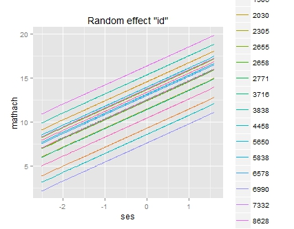
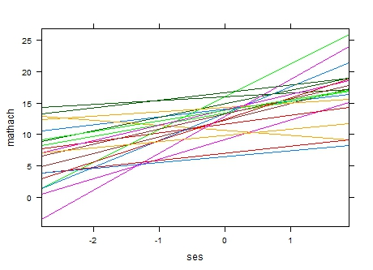

class: front


```{r setup, include=FALSE, cache = FALSE}
require("knitr")
opts_chunk$set(warning=FALSE,
             message=FALSE,
             echo=TRUE,
             cache = TRUE, fig.width=7, fig.height=5.2)
pacman::p_load(flipbookr, tidyverse)
```


```{r xaringanExtra, include=FALSE}
xaringanExtra::use_xaringan_extra(c("tile_view", "animate_css"))
xaringanExtra::use_scribble()
```

.pull-left-wide[
# Modelos multinivel]

.pull-right-narrow[]

## Unidades en contexto

----
.pull-left[

## Juan Carlos Castillo
## Sociología FACSO - UChile
## 2do Sem 2023 
## [.yellow[multinivel-facso.netlify.com]](https://multinivel-facso.netlify.com)
]
    

.pull-right-narrow[
.center[
.content-block-gray[
## Sesión 8: 
## **.yellow[Interacciones entre niveles]**]
]
]
---

layout: true
class: animated, fadeIn

---
class: roja right
# Contenidos


## .yellow[1- Resumen sesión anterior]

## 2- Interacción entre niveles


```{r echo=FALSE}
pacman::p_load(
haven,  # lectura de datos formato externo
car, # varias funciones, ej scatterplot
dplyr, # varios gestión de datos
stargazer, # tablas
corrplot, # correlaciones
ggplot2, # gráficos
lme4) # multilevel

mlm <-read_dta("http://www.stata-press.com/data/mlmus3/hsb.dta") # datos

mlm=mlm %>% select(
  minority,female,ses,mathach, # nivel 1
  size, sector,mnses,schoolid) %>%  # nivel 2
  as.data.frame()

agg_mlm=mlm %>% group_by(schoolid) %>%
  summarise_all(funs(mean)) %>% as.data.frame()
```
---
## Ej.Estimación de intercepto aleatorio (medias posteriores)

.small[

.pull-left[
```{r, echo=TRUE}
library(lme4)
mlm = read_dta("http://www.stata-press.com/data/mlmus3/hsb.dta")
results_0 <-lmer(mathach ~ 1 +  (1 | schoolid), data=mlm) 

```
]


.pull-right[

```{r}
sjPlot::tab_model(results_0)
```

]
]

---
.medium[

.pull-left[
```{r}
coef(results_0) 
```
]

.pull-right[
```{r}
ranef(results_0) 
```
]
]


---
# Ej: escuela 1224

- con `ranef` obtenemos su efecto aleatorio $\mu$ = -2.66, que equivale a su desviación del gran intercepto $\gamma_{00}$

- $\gamma_{00}$ = 12.64

- el valor predicho para el intercepto de la escuela 1224 es $\gamma{00} + \mu_j$

- 12.64 + (-2.66) = 9.98 , que es el valor que se obtiene para esta escuela con la función `coef`


---
## Coeficientes de regresión - predicción con efectos fijos
.small[
```{r}
results_4 = lmer(mathach ~ 1 + ses + female + mnses + sector + (1 | schoolid), data=mlm)
coef(results_4) # coef: comando que muestra coeficientes por grupo $id
```
]

---
## Coeficientes regresión - predicción con pendiente aleatoria
.small[
```{r}
results_5 = lmer(mathach ~ 1 + ses + female + mnses + sector + (1 + ses | schoolid), data=mlm)
coef(results_5) # coef: comando que muestra coeficientes por grupo $id
```
]

---
.medium[
```{r}
ranef(results_5)
```
]

---
## Plots: intercepto aleatorio


---
## Plots: pendiente aleatoria



---
## Plots


---
# Resumen predicción efectos aleatorios

Usos

-   Pedagógico: para entender el sentido de la estimación con modelos
    mixtos (efectos fijos y aleatorios)

-   Diagnóstico: para analizar y visualizar la variación de unidades de
    nivel dos a nivel de intercepto y pendiente(s)

-   Informativo: para conocer los resultados de las unidades de nivel 2
    y sus variaciones

-   Contraste de hipótesis de investigación

---
class: roja right
# Contenidos


## 1- Resumen sesión anterior

## .yellow[2- Interacción entre niveles]


---
# Interacciones entre niveles: bases

¿Qué es una interacción en un modelo de regresión?

.pull-left[
.content-box-red[
-> en términos de .red[especificación]: un término multiplicativo entre predictores (ej: edad x sexo) que se suma a la ecuación 
]
]

.pull-right[
.content-box-green[
-> en términos de .red[hipótesis]: test de una relación de .red[moderación].
]
]
---
# Ejemplo:

- hipótesis 1: mujeres se identifican más con la izquierda que los hombres

- hipótesis 2: a medida que aumenta la edad, aumenta la identificación con la derecha

- hipótesis de interacción: el efecto de la edad en la identificación con la derecha es **moderado** por el sexo 

---
class: middle center


Si la interacción es significativa quiere decir que las **diferencias entre pendientes** son distintas de cero

---
# Interacciones entre niveles en MLM

.pull-left[

- Modelo multinivel con predictores individuales y contextuales

.center[]
]
--

.pull-right[
- 	Modelo multinivel con interacción entre niveles

.center[

.red[¿Existen cambios en la relación entre x e y en función de una variable Z?]
]
]

---
# Interacciones entre niveles en MLM

- la variable nivel 2 (Z) modera la relación entre x e y

- se especifica multiplicando x*Z:
.medium[

```{r, eval=FALSE}
reg_mlm <-lmer (y ~ 1 + x + Z  # efectos principales
                  + x*Z  # interacción
                  + (1 + x | cluster), # pendiente aleatoria
                  data=datosmlm)
```
]

.center[
.red[Interpretación: por cada unidad de aumento en Z, la relación entre x e y se modifica en $\gamma_{11}$ (coeficiente de interacción)
]]
---
# Interacciones entre niveles y pendiente aleatoria

- al .red[aleatorizar una pendiente] se puede evaluar mediante un test de devianza si la varianza de la pendiente es significativa o no

--

- si hay evidencia de variación, .red[se procede con la interacción entre niveles]

--


- si la .red[interacción es significativa], entonces parte de la varianza de la pendiente se asocia al predictor de nivel 2

--

- y por lo tanto, el efecto aleatorio asociado a la pendiente .red[disminuye significativamente] en el modelo con interacción

---
class: inverse, middle, center

# Interacciones entre niveles

## Ejemplo 1 HSB data

¿En qué medida el carácter público o privado de la escuela afectan la relación entre nivel socioeconómico y desempeño en matemáticas?

---
## Datos e inspección de variables

```{r}
pacman::p_load(lme4,sjPlot,haven, texreg, summarytools)
mlm = read_dta("http://www.stata-press.com/data/mlmus3/hsb.dta")
```

### Variables principales:

- y = mathach, puntaje en matemática

- x = ses, nivel socioeconómico individual

- Z = sector, tipo de escuela (pública - privada)

---
- Selección de variables

```{r}
mlm_int <- mlm %>% select(mathach, 
                          ses, 
                          sector, 
                          schoolid) %>% 
                   as.data.frame()
```

---
# Exploración inicial
.small[
```{r}
sjmisc::descr(mlm_int,show = c("label","range", "mean", "sd", "NA.prc", "n")) %>% kable(.,digits =2,"markdown")
```
]

---
# Descriptivos con gtsummary

- vamos a probar la función .red[`tbl_summary`] de la librería .blue[`gtsummary`] para descriptivos
.medium[
  - ventajas:

      - output resumido
      - customizable
      - permite distinguir en una misma tabla entre variables categóricas y continuas
    


  - desventaja:

      - sintaxis algo críptica, requiere costumbre ... pero una vez que se establecen opciones básicas solo se reemplazan la(s) variable(s)
  ]

---
# Descriptivos nivel 1

.medium[
.pull-left[
```{r results='hide'}
pacman::p_load(gtsummary)
mlm_int %>% select(mathach,ses) %>% 
  tbl_summary(.,
    statistic = list(all_continuous() ~ "{mean} ({sd}) [{min}, {max}]",
                     all_categorical() ~ "{n} / {N} ({p}%)"),
     type   = all_categorical() ~ "categorical",
     digits = all_continuous() ~ 1,   ) %>% 
  modify_header(label = "**Variable**")
```
]
]

.pull-right[
<br>
```{r echo=FALSE}
pacman::p_load(gtsummary)
mlm_int %>% select(mathach,ses) %>% 
  tbl_summary(.,
    statistic = list(all_continuous() ~ "{mean} ({sd}) [{min}, {max}]",
                     all_categorical() ~ "{n} / {N} ({p}%)"),
     type   = all_categorical() ~ "categorical",
     digits = all_continuous() ~ 1,   ) %>% 
  modify_header(label = "**Variable**")  %>% 
  as_kable_extra(booktabs = TRUE) %>%
  kableExtra::kable_styling(font_size = 30)
```
]


---
## Descriptivos nivel 2 con tbl_summary (gtsummary)

```{r results='hide'}
mlm_int %>% group_by(schoolid) %>%  summarise_all(funs(mean)) %>%
  select(sector) %>% 
  sjlabelled::set_labels(sector,labels=c ("Publico"=0,
                      "Privado"=1)) %>%   
  sjlabelled::as_character(sector) %>% 
  tbl_summary(.,
    statistic = list(all_continuous() ~ "{mean} ({sd}) [{min}, {max}]",
                     all_categorical() ~ "{n} ({p}%)"),
     type   = all_categorical() ~ "categorical",
     digits = all_continuous() ~ 1,   ) %>% 
  modify_header(label = "**Variable**")
```
---
## Descriptivos nivel 2 con tbl_summary (gtsummary)

<br>
```{r echo=FALSE}
mlm_int %>% group_by(schoolid) %>%  summarise_all(funs(mean)) %>%
  select(sector) %>% 
  sjlabelled::set_labels(sector,labels=c ("Publico"=0,
                      "Privado"=1)) %>%   
  sjlabelled::as_character(sector) %>% 
  tbl_summary(.,
    statistic = list(all_continuous() ~ "{mean} ({sd}) [{min}, {max}]",
                     all_categorical() ~ "{n} ({p}%)"),
     type   = all_categorical() ~ "categorical",
     digits = all_continuous() ~ 1,   ) %>% 
  modify_header(label = "**Variable**") %>% 
  as_kable_extra(booktabs = TRUE) %>%
  kableExtra::kable_styling(font_size = 30)
```

---
## 1. Evaluar ajuste modelo pendiente aleatoria


```{r}
# Modelo con pendiente fija

reg_mlm_a = lmer(mathach ~ 1 + ses + sector + 
                   (1 | schoolid), data=mlm_int)


# Modelo con pendiente aleatoria
reg_mlm_b = lmer(mathach ~ 1 + ses + sector + 
                    (1 + ses | schoolid), data=mlm_int)

```

---

.small[
```{r, results='asis', echo=FALSE}
htmlreg(c(reg_mlm_a,reg_mlm_b), doctype = FALSE)

```
]

---
## Devianza

.small[
```{r}
anova(reg_mlm_a,reg_mlm_b)
```
]

-> Modelo con pendiente aleatoria es distinto al modelo sin pendiente aleatoria  (p<0.05)

---
# Estimación de modelo con interacción entre niveles

```{r}
reg_mlm_c = lmer(mathach ~ 1 + ses + sector +
                   ses*sector +
                   (1 + ses | schoolid), data=mlm)

```

---

.pull-left-wide[
.small[
```{r, results='asis', echo=FALSE}
htmlreg(c(reg_mlm_a,reg_mlm_b,reg_mlm_c), doctype = FALSE)
```
]
]

.pull-right-narrow[
<br><br><br>
Por cada unidad de aumento en sector, el efecto de ses en mathach cambia en -1.31

Como sector=1 (dummy), entonces la pendiente de ses para sector=1 es 2.13-1.31=0.82

]
---

.pull-left-narrow[
```{r, eval=FALSE}
plot_model(
  reg_mlm_c, 
  type = "int")

```
]

.pull-right-wide[
```{r, fig.width=10, fig.height=8, echo=FALSE}
plot_model(
  reg_mlm_c, 
  type = "int")

```
]

---
class: inverse
## ¿Qué significa este resultado?

- recordemos que la interacción es una diferencia de **pendientes**

- la pendiente de ses en mathach es distinta (de cero) segun sector

- recordemos que privado=1, y la interacción es negativa. Es decir, el sector correspondiente a 1 (privado) tiene una pendiente mas negativa (o menos positiva) que el sector 0 (público)

---
class: inverse
## ¿Qué significa este resultado?

Entonces ...

- la relación entre el nivel socioeconómico de los estudiantes y rendimiento en matemáticas es menor en colegios privados (1)

- efecto "ecualizador" de escuelas privadas?

---
class: inverse
## Resumen

- la interacción entre niveles en modelos multinivel es una extensión de interacciones en modelos de regresión OLS

- en el caso mutinivel, la interacción entre niveles es la que especifica entre una variable de nivel 1 y una de nivel 2

- en interacción entre niveles, la variable de nivel 2 busca dar cuenta de la variabilidad de la pendiente de la variable de nivel 1

---
class: front
.pull-left-wide[
# Modelos multinivel]

.pull-right-narrow[]

## Unidades en contexto

----
.pull-left[

## Juan Carlos Castillo
## Sociología FACSO - UChile
## 2do Sem 2023 
## [.yellow[multinivel-facso.netlify.com]](https://multinivel-facso.netlify.com)
]
    

.pull-right-narrow[
.center[

]
]
