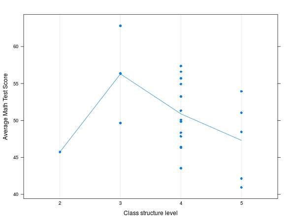
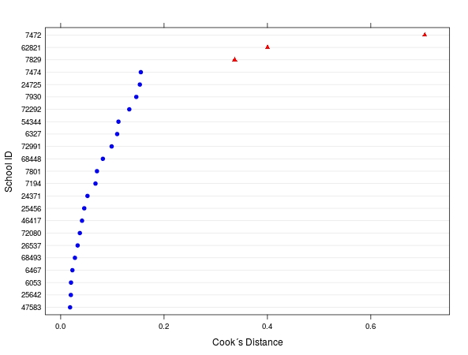
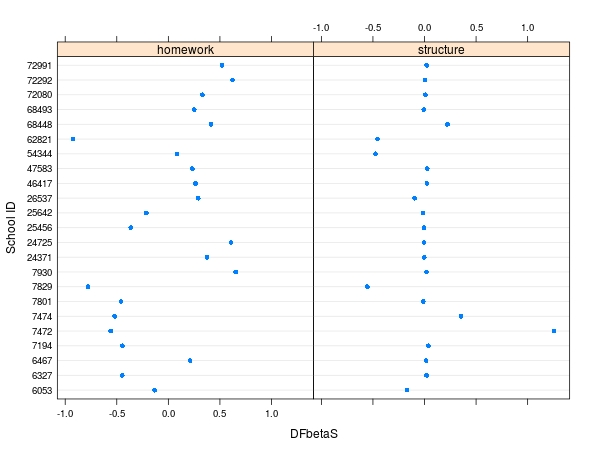

class: front


```{r setup, include=FALSE, cache = FALSE}
require("knitr")
opts_chunk$set(warning=FALSE,
             message=FALSE,
             echo=TRUE,
             cache = TRUE, fig.width=7, fig.height=5.2)
pacman::p_load(flipbookr, tidyverse)
```


```{r xaringanExtra, include=FALSE}
xaringanExtra::use_xaringan_extra(c("tile_view", "animate_css"))
xaringanExtra::use_scribble()
```

.pull-left-wide[
# Modelos multinivel]

.pull-right-narrow[]

## Unidades en contexto

----
.pull-left[

## Juan Carlos Castillo
## Sociología FACSO - UChile
## 2do Sem 2023 
## [.yellow[multinivel-facso.netlify.com]](https://multinivel-facso.netlify.com)
]
    

.pull-right-narrow[
.center[
.content-block-gray[
## Sesión 10: 
## **.yellow[Extensiones]**]
]
]
---

layout: true
class: animated, fadeIn

---
class: roja, middle, center

Variables dependientes categóricas
==================================

---
# Introducción

-   Los modelos revisados hasta ahora asumen distribución normal de la variable y principalmente de los errores

-   Con variables dependientes categóricas se hace difícil mantener este supuesto, y se utilizan modelamientos como:

  -   Regresión logística / probit, para dependientes dicotómicas
  -   Regresión ordinal, para dependientes categóricas ordenadas
  -   Regresión multinomial , dependientes politómicas
  -   Regresión poisson, para variables de conteo
  -   ... etc.

---
# Bases: ODDS

-   .red[Odds (razón de probabilidades)]: probabilidad de que algo ocurra
    dividida por la probabilidad de que no ocurra

-   Ej: en un curso de 100, 70 son mujeres

-   Probabilidad de “sacar” una mujer al azar del curso: 70%, 0,7

    $$Odds\left(\frac{0,7}{1-0,7}\right)=2,33$$

-   Es 2,33 veces más probable que alguien sea mujer a que no lo sea


---
# Odds-ratio

-   Medida de asociación entre variables

-   Es una razón de odds (ej: ser mujer y ser de izquierda)

-   Varia de 0 a infinito, valores menores a 1 indican asociación
    negativa, que aumenta a medida que se acerca al 0.

- Detalles: ver sesión estadística multivariada [aquí](https://juancarloscastillo.github.io/metsoc-facsouchile/documents/presentaciones/9intrologit/9_intrologit.html#1)

---
# Modelo de regresión logística:

$$ln\left(\frac{p(y=1)}{1-p(y=1)}\right)=\beta_0+\beta_1x$$

-   Donde el *logit* es el log de los odds (logit link), que permite
    vincular la variable categórica a un modelo de regresión

-   Para obtener el odd desde el logit hay que exponenciarlo

---
# Ej. Finch et al 2015, Cap.7

Pregunta: .red[¿en qué medida la fatiga al caminar puede predecir enfermedad coronaria?
]


-   Variable dependiente: diagnóstico de enfermedad (arteria coronaria)

-   Variable independiente: tiempo de caminata hasta fatigarse

---
Logística 1 nivel

.medium[

```
coronary.logistic=glm(group~time, family = binomial)
summary(coronary.logistic)

Coefficients:
             Estimate Std. Error  z value  Pr(>|z|)
(Intercept) 13.488949   5.876693   2.295   0.0217 *
time        -0.016534   0.007358  -2.247   0.0246 *


 > exp(coef(coronary.logistic))
 (Intercept)         time
 7.214000e+05 9.836024e-01
```
]
---
### Interpretación

-   $\beta_1=-0.0165$

    -   General: mientras más tiempo camina, menos probable que tenga
        enfermedad coronaria

    -   Logit: Por cada segundo que camina, el log de los odds de
        enfermedad coronaria disminuye en 0.0165

    -   Transformando el logit ( $e^{0.0165}=0.984$ ): por cada segundo
        adicional antes de fatigarse, los odds de tener problemas
        cardiacos disminuyen en 0.984, y por cada minuto
        $e^{0.0165*60}=0.378$


---
## Estimación datos categóricos multinivel en `R`

-   El principal comando de R para estimar modelos multinivel para variables categóricas es `glmer`, que es parte de la libreria `lme4`

-   La sintaxis para `glmer` es similar a la del comando `lmer`, agregando algunas opciones adicionales, por ejemplo para logistica se agrega `family = binomial(logit)`, mientras que para la regresión poisson se agrega `family = poisson)`

---
# Estimación datos categóricos multinivel en `R`

-   En el caso de variables **ordinales**, se utiliza la librería `ordinal`, en particular la función `clmm`, cuya sintaxis es similar a `lmer`

-   Para multinomial, la implementación es vía `mclogit` o  `MCMCglmm` (detalles fuera del alcance de este curso)

---
# ICC logística

-   Escalamiento de la varianza de los residuos (individuales) en regresión logística: relacionado con cálculo ICC

-   Para el caso de logística: $\frac{\pi^2}{3}$, que es igual a 3.29

---
# Recomendaciones generales

-   Buena exploración de los datos, tablas cruzadas, análisis de missings, N por cluster, etc.

-   Analizar temas de centrado

-   Implementar cuidadosamente los modelos, se requiere conocimiento previo de modelos para datos categóricos a nivel individual

---
class: roja, middle, center

Modelos de 3 (o más) niveles
====================

---
## Introducción

-   Existen estructuras de datos con jerarquía de más de dos niveles,
    ej:

    -   estudiantes / salas de clases / colegios

    -   personas / organizaciones / tiempo

-   Implica agregar efectos aleatorios asociados a los distintos niveles

-   Requiere teorías e hipótesis apropiadas a una estructura de este tipo 

---
## Estimación R

-   Similar a 2 niveles, cambia especificación de efectos aleatorios

-   Ejemplo:

    `Model4.7 <- lmer(geread 1+(1|school/class)`

-   El nivel mayor va a la izquierda, es decir, cursos (class) anidado
    en escuela
---
## Correlación intra-clase + de 2 niveles

-   Asumiendo $\sigma^2_1$ varianza de nivel 1, $\sigma^2_2$ nivel 2, y
    $\sigma^2_3$ nivel 3 (es decir, el $\tau_{00}$ (L2) es $\sigma^2_2$,
    y el $\tau_{00}$ (L3) es $\sigma^2_3$)

-   Siguiendo a Hedges et al (2012), la correlación intra-clase para un
    modelo de tres niveles con varianzas, se puede calcular de la
    siguiente manera:

$$\begin{aligned}
    L2:\rho_2=\frac{\sigma^2_2}{\sigma^2_1+\sigma^2_2+\sigma^2_3} \\
    L3:\rho_3=\frac{\sigma^2_3}{\sigma^2_1+\sigma^2_2+\sigma^2_3}
    \end{aligned}$$

### *Ejemplo: ver Finch cap. 4 (datos Achieve.csv)*

---
class: roja, middle, center

# Casos influyentes

---
## Bases

-   **Residuo**: diferencia entre predicción y valor observado

-   **Outlier**: en regresión, una observación con un gran residuo

-   **Leverage** (palanca): medida de la desviación de la variable
    independiente de su promedio de acuerdo a algun valor observado.
    Puntos de alto leverage afectan la estimación de los coeficientes de
    regresión

-   **Influencia**: una observación posee alta influencia si al removerla
    cambia sustancialmente los coeficientes. Puntos de influencia son
    outliers con alto leverage

---
## Medidas de casos influyentes


### - DFBETAS: 
  - para variables independientes por separado

### - Distancia de Cook (D): para el modelo completo

- En el caso de análisis de observaciones influyentes en modelos
multinivel, se refieren a casos influyentes de **nivel 2**

---
## DFbetas

-   describen la influencia estandarizada que una observación (en este
    caso de nivel 2) posee en cada una de las variables independientes
    en el modelo.

-   Se pueden interpretar como la diferencia estandarizada en la
    pendiente estimada con y sin la unidad *j*

---
## DFbetas

$$DFBETAS_{ij}=\frac{\hat{\gamma}_i - \hat{\gamma}_{i-j}} {se(\hat{\gamma}_{i-j})}$$

-   Donde 

  - $\hat{\gamma}_i$ representa la estimación original del
    parámetro
    
  -  $\hat{\gamma}_{i-j}$ es la estimación de la pendiente
    cuando se excluye a la unidad $j$.

---
## DFbetas

-   de acuerdo a Belsley et al (1980) el valor de corte para interpretar
    los DFBETAS equivale a $2/\sqrt{n}$ , donde $n$ se refiere al número
    de observaciones, en este caso, unidades de nivel 2

-   Valores que sobrepasan este nivel se consideran influyentes para la
    estimación del parámetro
---
## Distancia de Cook

-   medida que combina la información de leverage y del residuo de la observación.

-   Describe la influencia que la exclusión de una observación posee en la estimación de los parámetros estimados del **modelo completo**

---
## Distancia de Cook

$$C^{0F}_{j}=\frac{1} {r + 1}(\hat{\gamma}-\hat{\gamma}_{-j}) \Sigma^{-1}_{f}(\hat{\gamma}-\hat{\gamma}_{-j})$$

.medium[

-   $\hat{\gamma}_i$ representa el vector de la estimación original del parámetro, y $\hat{\gamma}_{i-j}$ es la estimación de la pendiente cuando se excluye a la unidad $j$.

-   $\Sigma_{f}$ representa la matriz de covarianzas

-   $r$ es el número de parámetros a evaluar, excluyendo el vector de intercepto

-   el valor de corte para interpretar la distanciade Cook equivale a $4/n$ , donde $n$ se refiere al número de observaciones, en este caso, unidades de nivel 2

-   Valores que sobrepasan este nivel se consideran influyentes para la estimación del modelo
]
---
###  `influence.ME` 


-   Paquete de R para estimación de medidas de influencia en modelos multinivel

-   Permite calcular DFBETAS, distancia de Cook, otras medidas de influencia, plots, significancia, entre otras.

- link a artículo de documentación de la librería: [https://journal.r-project.org/archive/2012/RJ-2012-011/RJ-2012-011.pdf](https://journal.r-project.org/archive/2012/RJ-2012-011/RJ-2012-011.pdf)

---
### Ejemplo `influence.ME`

### Datos y variables

-   ejemplo provisto en la documentación de la librería (Nieuwenhuis et al 2012)

-   Datos : estudiantes en 23 escuelas

-   Dependiente: rendimiento en matemática

-   Independiente L1: homework, tiempo realizando tareas

-   Independiente L2: structure, grado de estructura de las clases

---
### `influence.ME`

-   Ejemplo: `estex.m23 <- influence(m23, school.ID)` , crea objeto extex.m23 basado en el objeto m23 de un modelo lmer donde la variable de cluster es school.ID
.medium[
-   `influence`: función principal, permite crear objeto que guarda estimaciones de influencia en base a un objeto generado con `lme4`

-   `dfbetas`: estima los DFBETAS

-   `cooks.distance`: estima distancia de cook

-   `sigtest`: estima significación de la influencia
]

---
## Gráficos

Referencia: descriptivo variable L2 (structure) en puntaje matemática



---
## Gráficos `influence.ME`: Distancia de Cook




---
## Gráficos `influence.ME`: dfBetas



---
## Resumen casos influyentes

-   Influencia: outliers + leverage

-   Principales medidas

    -   DfBetas: para cada covariable, influencia $> \frac{2}{\sqrt{n}}$

    -   Distancia de Cook: influencia del caso en modelo completo, corte $\frac{4}{n}$

-   En presencia de casos influyentes, probar modelo con y sin el caso al final del análisis, en el sentido de prueba de robustez

---
class: front
.pull-left-wide[
# Modelos multinivel]

.pull-right-narrow[]

## Unidades en contexto

----
.pull-left[

## Juan Carlos Castillo
## Sociología FACSO - UChile
## 2do Sem 2023 
## [.yellow[multinivel-facso.netlify.com]](https://multinivel-facso.netlify.com)
]
    

.pull-right-narrow[
.center[

]
]
