class: bottom, right, inverse

```{r eval=FALSE, include=FALSE}
# Correr esto para que funcione el infinite moonreader, el root folder debe ser static para si dirigir solo "bajndo" en directorios hacia el bib y otros

xaringan::inf_mr('/static/docpres/02_bases/2mlmbases.Rmd')
```

```{r setup, include=FALSE, cache = FALSE}
require("knitr")
options(htmltools.dir.version = FALSE)
pacman::p_load(RefManageR)
# bib <- ReadBib("../../bib/electivomultinivel.bib", check = FALSE)
opts_chunk$set(warning=FALSE,
             message=FALSE,
             echo=TRUE,
             cache = TRUE,fig.width=7, fig.height=5.2)
```

<!---
Para correr en ATOM
- open terminal, abrir R (simplemente, R y enter)
- rmarkdown::render('static/docpres/07_interacciones/7interacciones.Rmd', 'xaringan::moon_reader')

About macros.js: permite escalar las imágenes como [scale 50%](path to image), hay si que grabar ese archivo js en el directorio.
--->

.pull-left[.center[
<br>
<br>
<br>
<br>
<br>
<br>
<br>
<br>
]]

.pull-right[
# Modelos Multinivel
### Juan Carlos Castillo
### Sociología FACSO - UChile
### 2do Sem 2019
### [multinivel.netlify.com](https://multinivel.netlify.com)


<br>

## Sesión 8: Centrado de variables

]

---
class: roja, middle, center


# Resumen

---
# Modelos multinivel

-   Dependencia contextual, datos anidados y falacia ecológica

-   Estimación de modelo de coeficientes aleatorios

-   Correlación intra-clase

-   Pendientes aleatorias

-   Interacción entre niveles

-   Ajuste


---
class: roja, middle, center

# Bases: Centrado en regresión simple

---
## Regresión y centrado

-   El centrado de las variables en regresión simple posee consecuencias
    en el valor del intercepto

-   Intercepto: estimación del valor de la variable dependiente cuando
    los predictores son 0

-   La estimación sin centrar en algunos casos puede llevar a algunos
    problemas en la interpretación de los parámetros del modelo

-   El centrado se implementa restando una constante del predictor
    (usualmente el promedio)

---

## Ejemplo centrado regresión simple

Datos: puntaje en CI y en una escala de felicidad 1-7

    > mydata
        felicidad  ci
    1         1     90
    2         3     95
    3         4     98
    4         6     105

    lm(formula = felicidad ~ ci)

    (Intercept)           ci
    -28.5593       0.3305

¿Qué significa el valor del intercepto?

---
### Ejemplo centrado en regresión simple 

.center[
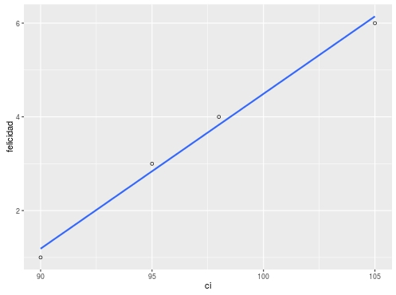 
]

---
### Ejemplo centrado en regresión simple 


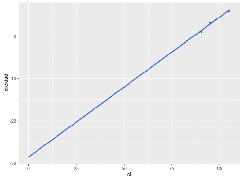

---
### Ejemplo centrado regresión simple

    > mydata
      felicidad  ci mean_ci cicent_mean cicent_100
    1         1  90      97          -7        -10
    2         3  95      97          -2         -5
    3         4  98      97           1         -2
    4         6 105      97           8          5

    lm(formula = felicidad ~ cicent_mean)
    (Intercept): 3.5000  ; cicent_mean:0.3305

    lm(formula = felicidad ~ cicent_100)
    (Intercept): 4.4915  ; mydata$cicent_100: 0.3305
        
---
### Ejemplo centrado en regresión simple

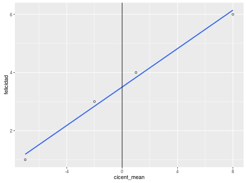

---
### Ejemplo centrado en regresión simple

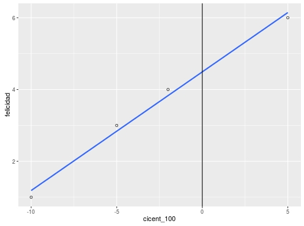

---

### Ejemplo centrado regresión simple V

-   $\beta$ constante en todos los modelos, varía solo intercepto

-   Modelo sin centrar: intercepto -28,5, felicidad para alguien con
    inteligencia 0 (no tiene mucho sentido ...)

-   Centrado al promedio: 3.5, estimación de la felicidad para alguien
    con inteligencia promedio

-   Centrado a 100: 4.49, estimación de la felicidad para alguien con
    inteligencia 100

---
class: roja, middle, center

# Centrado en modelos multinivel

---
# Distintos centrados según nivel

-   En MLM, las posibilidades de centrado se amplían según la cantidad
    de niveles que se tengan

-   Tomando como referencia dos niveles, el centrado de los predictores
    de nivel uno puede tomar 2 formas principales: 
      - a la gran media o promedio general (**CGM**)
      - al promedio al interior (within) de
    grupos/clusters (**CWC**) 
    

(nomenclatura Enders & Tofighi, 2007)

---
# Distintos centrados según nivel

-   El **CGM** es equivalente al de regresión simple para el mismo
    propósito: se resta el valor del promedio general

-   En el **CWC** se resta el promedio del grupo en lugar de la gran
    media

-   A diferencia de regresión simple, las decisiones respecto de
    centrado afectan más allá del valor del intercepto, influyendo en:

    -   valor de $\beta$

    -   componentes de la varianza ( $\tau_{00},\tau_{11},\tau_{01})$

    -   interacciones entre niveles

-   *CGM y CWC estiman la relación entre X e Y de distinta manera y
    producen intepretaciones distintas de los parámetros*
    
---    
# Distintos centrados según nivel

-   Pregunta principal: Which form of centering provides interpretable
    parameter estimates that can be used to address a particular
    substantive research question? (Enders & Tofighi 2007, p. 122)

-   Ejemplo: dataset artificial que maximiza las diferencias entre
    clusters para mostrar mejor los efectos de los distintos tipos de
    centrado (Enders & Tofighi, 2007)

-   Variable dependiente: bienestar

-   Variable independiente nivel 1 ( $\gamma_{10}$ )= horas de trabajo

-   Variable independiente nivel 2 ( $\gamma_{01}$ )= tamaño del grupo

---
## Centrado a la gran media
<br>
.center[
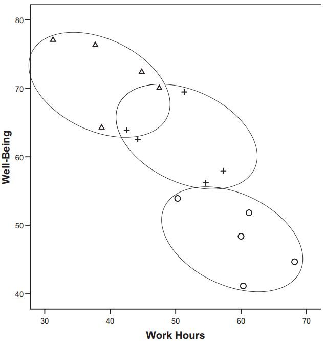   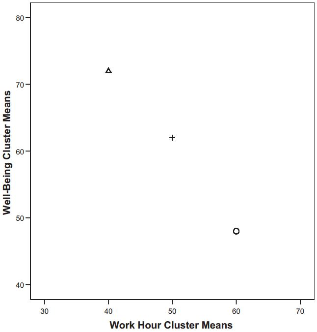
]
---
## CGM

-   La relación entre las horas de trabajo y bienestar posee componentes
    a nivel 1 y nivel 2

    -   Individuos que trabajan más tienen a tener menor bienestar (L1)

    -   Grupos que en promedio trabajan menos poseen menores niveles de
        bienestar (L2)

-   Como en regresión simple, en CGM no se altera la estimación de
    $\beta$, solo varía la estimación del valor del intercepto ...
    además de alterar otros parámetros (detalles más adelante)

---
## Comparación con centrado al grupo


 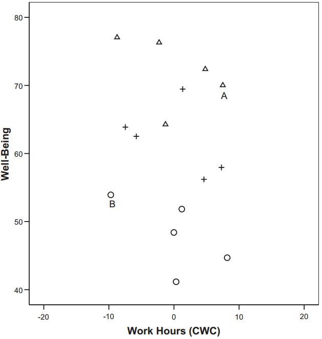

---
## Correlaciones entre especificaciones de centrado

.center[
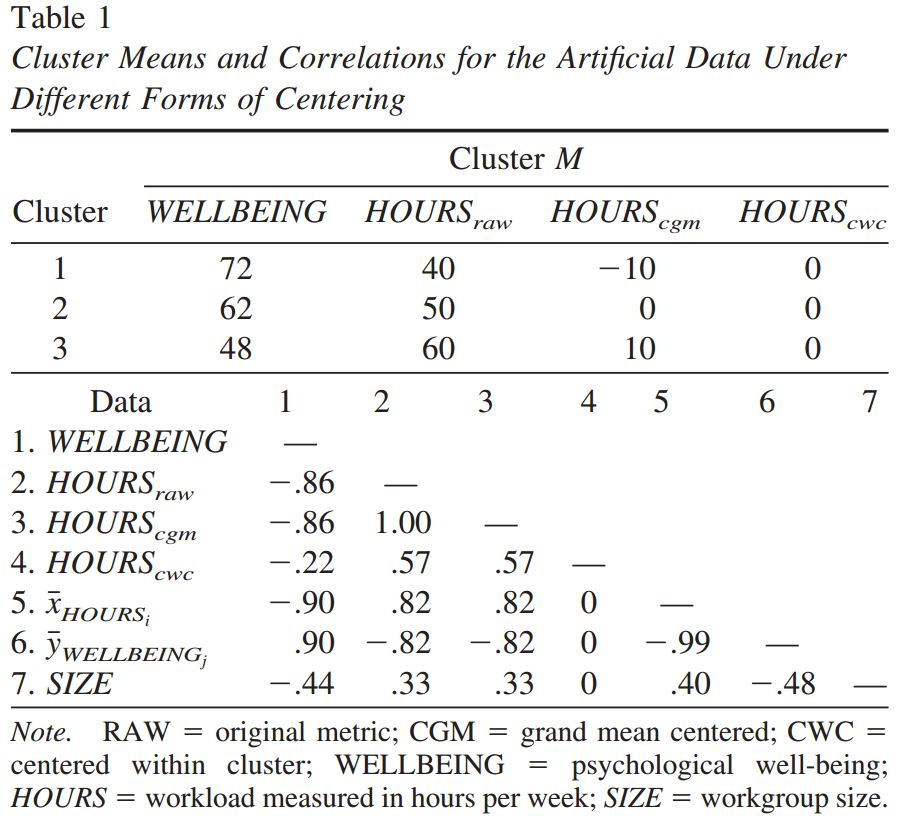
]

---
## Correlaciones entre especificaciones de centrado


En términos de correlación:

-   La correlación entre variables no varia entre puntajes brutos y
    centrados CGM

-   El CWC crea una variable distinta, y por tanto correlaciona distinto
    con otras

-   La variable CGM correlaciona tanto con predictores de nivel 1 como
    de nivel 2 (contiene en su covariación una dimiension *between*)

-   La variable CWC correlaciona 0 con predictores de nivel 2 (porque su
    varianza a nivel 2 es 0)

---
## En términos de regresión:

.center[
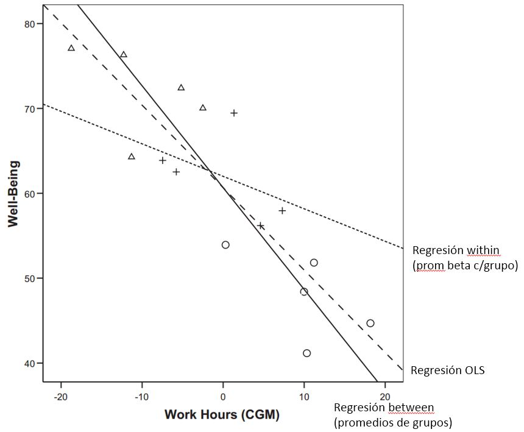
]

---
## Regresión multinivel y centrado

-   OLS puede verse como una combinación ponderada de los coeficientes
    between y within clusters

-   En CGM, $\gamma_{10}$ es una mezcla de asociación within y between:

    -   “the hierarchical estimator under grand-mean centering is an
        inappropriate estimator of the person-level [i.e., Level 1]
        effect. It too is an uninterpretable blend: neither $\beta_w$
        nor $\beta_b$” (Raudenbush and Bryk, 2002, p. 139).
---
## Regresión multinivel y centrado

-   En CGM, se altera también la estimación de la varianza de las
    pendientes ( $\tau_{11}$ ) al incorporar elementos between que pueden reducir variabilidad:
.center[
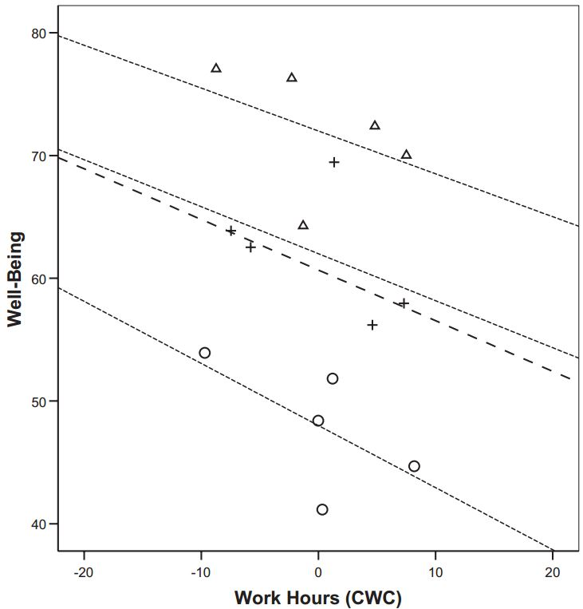
]

---
## En CWC:

-   No contiene variación entre clusters y por lo tanton o correlaciona con variables de nivel 2

-   El intercepto se interpreta como el promedio no ajustado del
    promedio de los clusters

-   Por lo tanto, con predictores CWC $\gamma_{00}$ es equivalente al
    del modelo nulo

-   En CWC la pendiente corresponde a la regresión within cluster, es un
    estimador “puro” de la relación nivel 1 entre x e y

-   La estimación de $\tau_{00}$ con un predictor CWC cuantifica la
    varianza de los promedios no ajustados; por lo tanto debería ser
    similar a la de un modelo incondicional (sin predictores)

---
## Centrado y 4 posibles focos de investigación

1.  Predictor de nivel 1

2.  Predictor de nivel 2

3.  Comparar la influencia de un predictor a distintos niveles

4.  Efectos de interacción

---
## 1. Predictor de nivel 1

Se recomienda CWC

-   Estimador “puro” de efectos nivel 1

-   Estimación más adecuada de la varianza de la pendiente

-   Sustantivamente: la posición relativa respecto del grupo es un
    determinante relevante para los individuos (comportamientos,
    actitudes, etc.)

---
## 2. Predictor de nivel 2

-   Si solo hay predictores de nivel 2, seguir recomendaciones de
    centrado de OLS

-   Cuando hay predictores de nivel 1, se recomienda CGM, ya que como
    contiene varianza between ajusta la estimación de los predictores de
    nivel 2

-   Ej: Enders & Tofighi Tabla 2, ver ajuste de predictor de tamaño
    (SIZE) cuando HOURS es CGM en lugar de CWC
---
class: middle

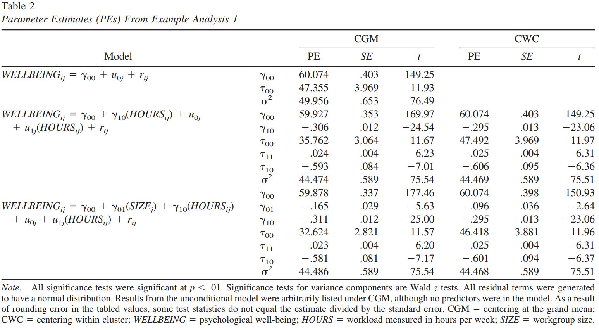

---
## 3. Predictor en ambos niveles

-   Caso de modelos contextuales o composicionales

-   Requiere usar los puntajes individuales y los promedios de los
    clusters

-   Por lo tanto se requiere descomponer la varianza de la pendiente en
    within y between,

-   El objetivo es saber si $\gamma_{01}$ es significativo y distinto de
    $\gamma_{10}$, es decir, si hay un efecto del grupo más allá del
    efecto individual

-   Al estar presentes los promedios de los clusters, $\gamma_{10}$ es
    equivalente para ambos centrados (CGM=CWC), ya que CGM se encuentra
    parcializado de los promedios grupales

---

-   Por lo tanto, dos vías equivalentes para evaluar esto:

    -   CWC: restar ambos coeficientes y ver si la diferencia es
        significativa
    -   CGM: si $\gamma_{01}$ es significativo implica que la diferencia
        es significativa

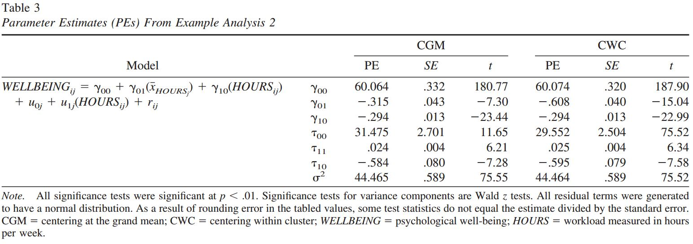

-   Para el caso de CWC:  $\gamma_{10}-\gamma_{01}=-.608-.294=.315$

-   Para CGM: $\gamma_{01}=.315$ (equivalente a la diferencia con CWC),
    y es significativo.

---
## 4. Interacción entre niveles

-   La estimación CGM de $\gamma_{11}$ (coeficiente de interacción) es
    una mezcla poco interpretable de interacciones a ambos niveles

-   CWC desacopla las interacciones

-   Por lo tanto, se recomienda CWC en interacciones entre niveles


---
class: inverse

# Resumen

- un predictor nivel 1 no centrado contiene elementos de varianza entre y dentro

- por lo tanto, se requiere separar ambas varianzas según las hipótesis a contrastar

- en general, para hipótesis de nivel 1 los predictores deben estar centrados al grupo, o controlados por el promedio del predictor por clusters como variable de nivel 2

- de especial relevancia al establecer hipótesis de interacciones entre niveles


---
class: inverse, bottom

.pull-left[.center[
<br>
<br>
<br>
<br>
<br>
<br>
<br>
<br>
]]

.pull-right[
# Modelos Multinivel
### Juan Carlos Castillo
### Sociología FACSO - UChile
### 2do Sem 2019
### [multinivel.netlify.com](https://multinivel.netlify.com)
]
